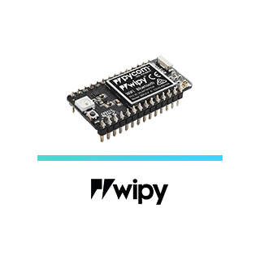

# 1.1 Hardware Setup

This chapter of the documentation will show you how to connect you Pycom module. For each device there are detailed instructions on how to connect your module to one of our base boards, a USB UART adapter or WiFi as well as what antennas you might need to connect. Please select your module below to be taken to the appropriate guide.

