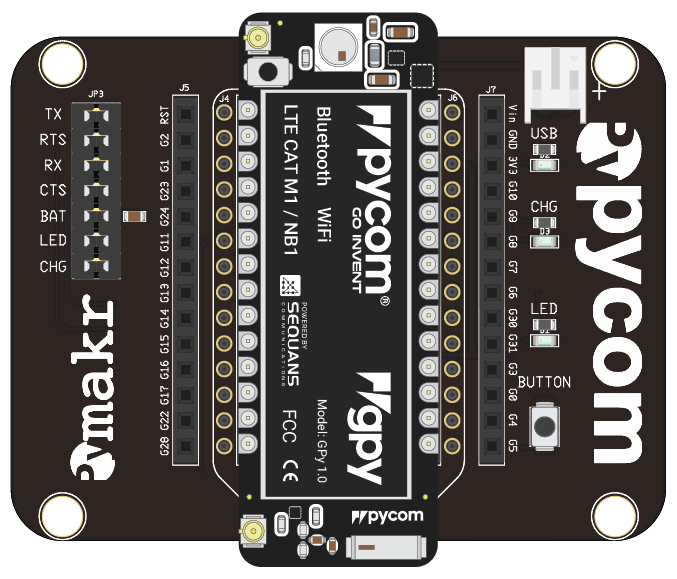
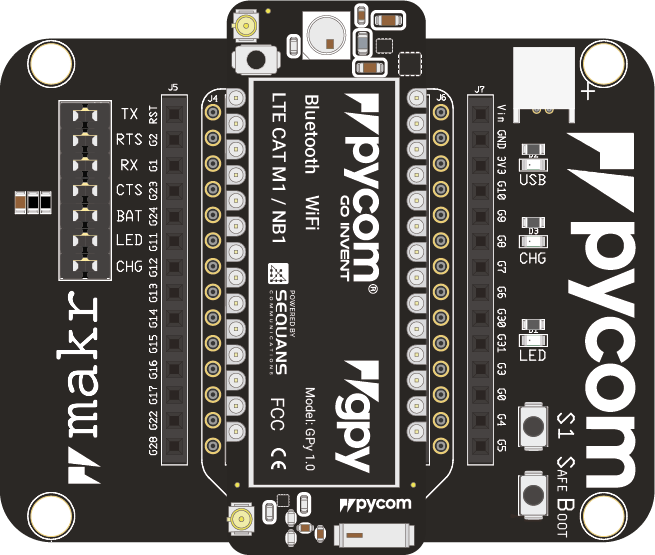
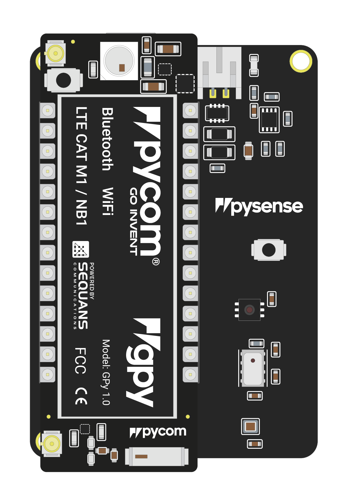
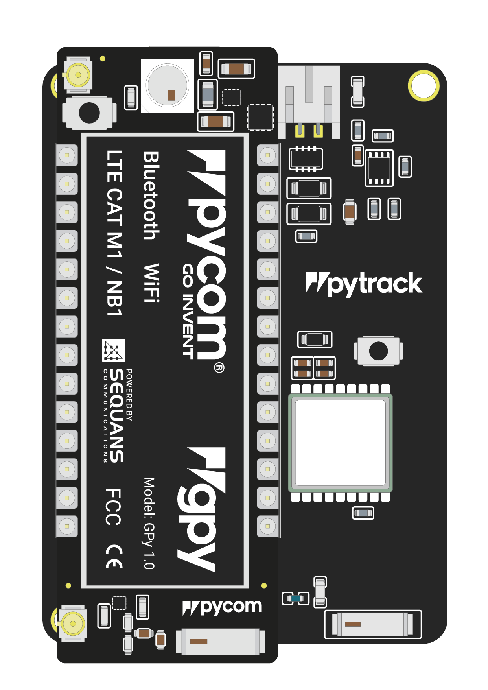
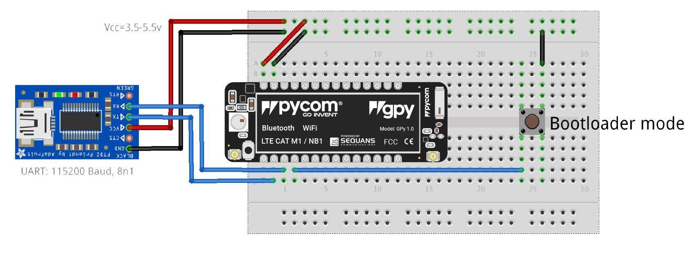
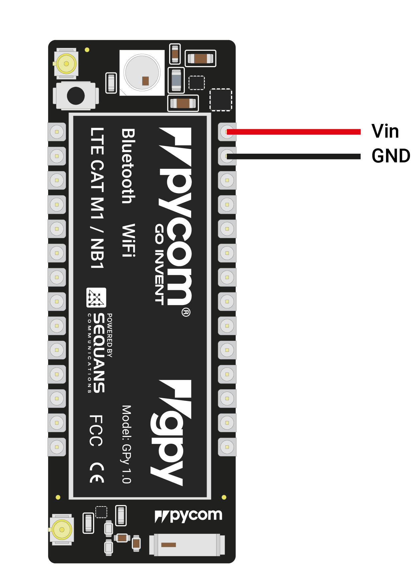
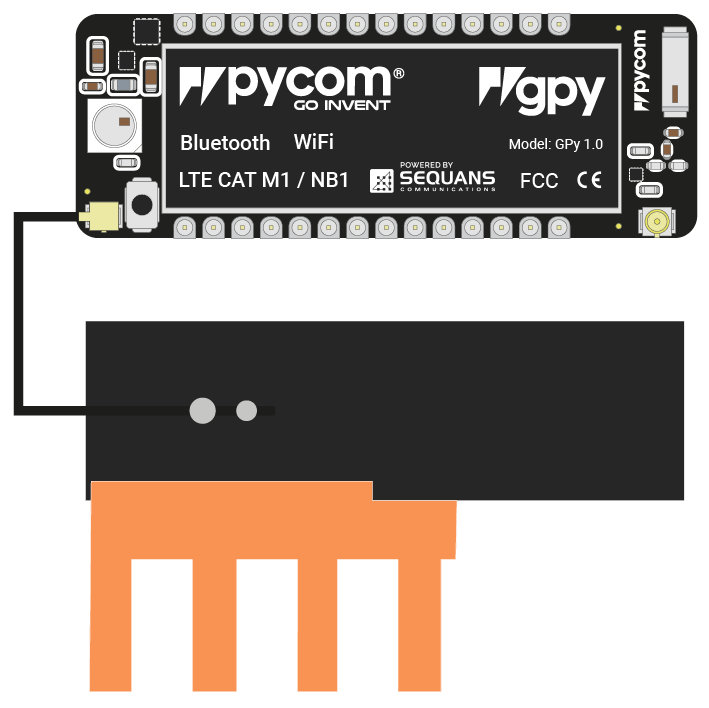
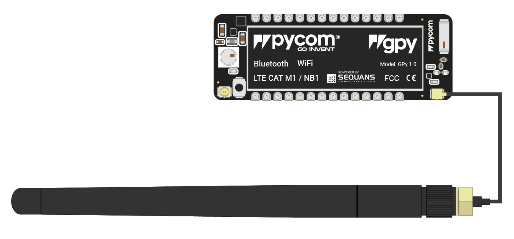
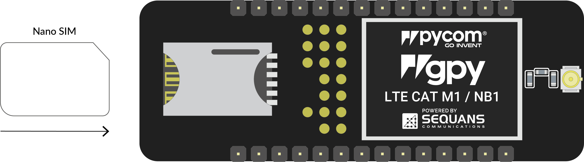

# 1.1.4 GPy

## Basic connection



* Look for the reset button on the module \(located at a corner of the board, next to the LED\).
* Locate the USB connector on the expansion board.
* Insert the GPy module on the the expansion board with the reset button pointing towards the USB connector. It should firmly click into place and the pins should now no longer be visible.




* Before connecting your module to an Expansion Board 3.0, you should update the firmware on the Expansion Board 3.0. Instructions on how to do this can be found [here](https://docs.pycom.io/chapter/pytrackpysense/installation/firmware.html).
* Look for the reset button on the module \(located at a corner of the board, next to the LED\).
* Locate the USB connector on the expansion board.
* Insert the GPy module on the Expansion Board with the reset button pointing towards the USB connector. It should firmly click into place and the pins should now no longer be visible.




* Before connecting your module to a Pysense/Pytrack/Pyscan board, you should update the firmware on the Pysense/Pytrack/Pyscan. Instructions on how to do this can be found [here](https://docs.pycom.io/chapter/pytrackpysense/installation/firmware.html).
* Look for the reset button on the GPy module \(located at a corner of the board, next to the LED\).
* Locate the USB connector on the Pysense/Pytrack/Pyscan.
* Insert the module on the Pysense/Pytrack/Pyscan with the reset button pointing towards the USB connector. It should firmly click into place and the pins should now no longer be visible.




* Firstly you will need to connect power to your GPy. You will need to supply `3.5v`-`5.5v` to the `Vin` pin.


Do **not** feed `3.3v` directly to the `3.3v` supply pin, this will damage the regulator.


* The connect the `RX` and `TX` of your USB UART to the `TX` and `RX` of the GPy respectively.


Please ensure you have the signal level of the UART adapter set to `3.3v` before connecting it.


* In order to put the GPy into bootloader mode to update the device firmware you will need to connect `P2` to `GND`. We recommend you connect a button between the two to make this simpler.




**Note:** This method of connection is not recommended for first time users. It is possible to lock yourself out of the device, requiring a USB connection.

* In order to access the GPy via WiFi you only need to provide `3.5v` - `5.5v` on the `Vin` pin of the GPy:

* By default, when the GPy boots, it will create a WiFi access point with the following credentials:
  * SSID:`gpy-wlan`
  * password: `www.pycom.io`
* Once connected to this network you will be able to access the telnet and FTP servers running on the GPy. For both of these the login details are:
  * username: `micro`
  * password: `python`



## Antennas

### LTE Cat-M1/NB-IoT


If you intend on using the LTE CAT-M1 or NB-IoT connectivity of the GPy you **must** connect a LTE CAT-M1/NB-IoT antenna to your GPy before trying to use LTE Cat-M1 or NB-IoT otherwise you risk damaging the device.


* You will need to connect the antenna to the GPy using the U.FL connector on the same side of the GPy as the LED.

### WiFi/Bluetooth \(optional\)

All Pycom modules, including the GPy, come with a on-board WiFi antenna as well as a U.FL connector for an external antenna. The external antenna is optional and only required if you need better performance or are mounting the GPy in such a way that the WiFi signal is blocked. Switching between the antennas is done via software, instructions for this can be found [here.](https://docs.pycom.io/chapter/firmwareapi/pycom/network/wlan.html)

### SIM card {#sim-card}

If you intend on using the LTE CAT-M1 or NB-IoT connectivity of the GPy you will need to insert a SIM card into your GPy. It should be noted that the GPy does not support regular LTE connectivity and you may require a special SIM. It is best to contact your local cellular providers for more information on acquiring a LTE CAT-M1/NB-IoT enabled nano SIM.

