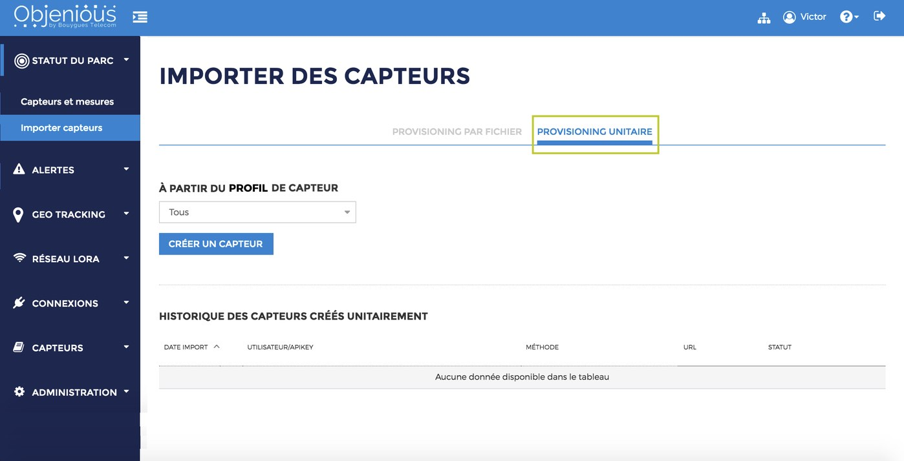

# 1.4.3.2 Objenious

## Identifiers

To connect a Pycom LoRa device \(LoPy, LoPy4, FiPy\) to Objenious you'll need to provision it. This requires three pieces of information

* Device EUI \(DevEUI\)
* Application EUI \(AppEUI\)
* Application Key \(AppKey\)

### Device EUI

This comes from the device itself and can be obtained from `lora.mac()`.  
To obtain the required hexadecimal representation you can run the following code on your LoPy:

```python
from network import LoRa
import ubinascii

lora = LoRa()
print("DevEUI: %s" % (ubinascii.hexlify(lora.mac()).decode('ascii')))
```

### Application EUI and Application Key

Application EUI and Key are two LoRaWAN parameters that should ideally by generated by you, if supplying devices to end customers.  
The Application EUI is a EUI-64 \(8 bytes\) identifier which should be universally unique - it's usually allocated from a MA-S block purchased from the [IEEE Registration Authority](http://standards.ieee.org/develop/regauth/oui36/index.html).  
The Application Key should be a randomly generated, secure, 128 bit \(16 byte\) token.

For testing purposes we provide a script which generates a random Application EUI from our assignment and a series of Application Keys:

[EUI/Key generator for testing](https://github.com/pycom/pycom-scripts/blob/master/lorakeys/generate_keys.py)

_\(note: the Application EUI produced by this script is not guaranteed to be unique\)_

To use the script make sure you are using Python 3.6 on your computer and run it \(on your computer, _not_ on the Pycom board\) as:

```bash
python generate_keys.py 1
```

The output will be similar to:

```text
AppEUI: 70b3d54923e36a89
AppKeys: 78fe712d96f46784a98b574a8cd616fe
```

If you are registering multiple devices you can generate more Applications Keys by changing `1` to your desired number of devices.

## Provisioning

Once you have the three identifiers for your device you need to register them on the Objenius portal.  
Follow "Importer des capteurs" under "Statuc do Parc" and select "Provisioning Unitaire":



Once there give your device a name and enter the DevEUI, AppEUI, and AppKey obtained from the steps above:


