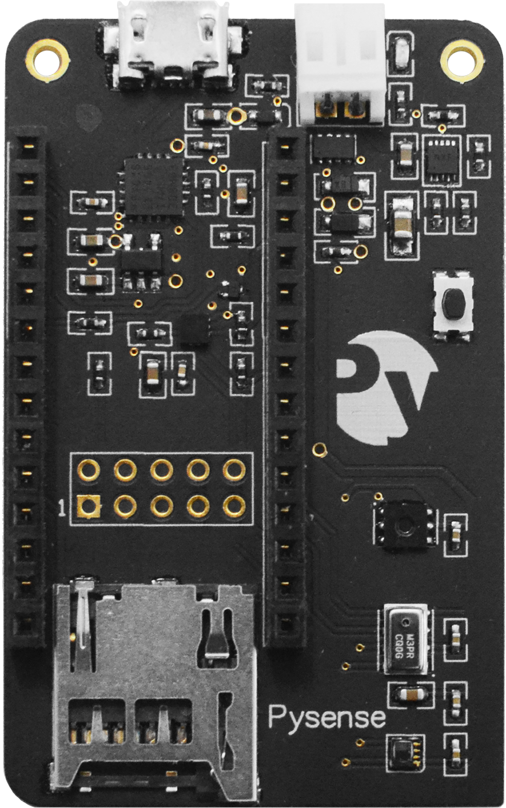
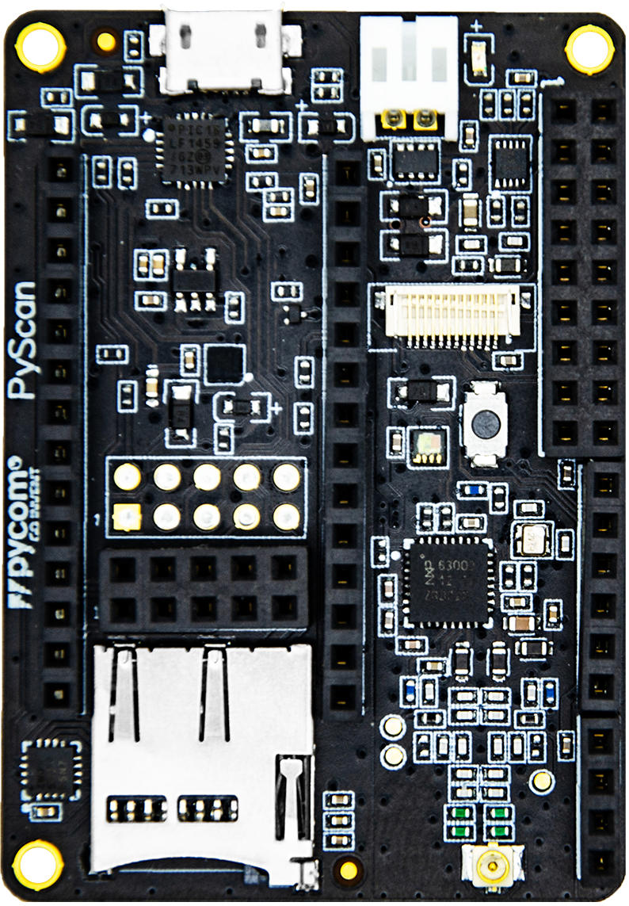

# 3.1 Introduction

In addition to the Expansion Board, Pycom also offers three additional sensor boards, which are ideal for quickly building a fully functioning IoT solution! Whether the application is environment sensing or asset tracking, these additional boards support a variety of sensors.

## Pytrack

Pytrack is a location enabled version of the Expansion Board, intended for use in GPS applications such as asset tracking or monitoring.

### Features & Hardware

The Pytrack is has a number of features including GPS, 3-Axis Accelerometer and Battery Charger. See the list below for detailed specifics about each sensor, including datasheets.

* Serial USB
* 3-Axis Accelerometer \([LIS2HH12](https://github.com/pycom/pycom-docs/tree/37661883902849b1a931ee273a23ae8e0f3d773e/chapter/pytrackpysense/apireference/pytrack.html)\)
* Battery Charger \(BQ24040 with JST connector\)
* GPS and GLONASS \([L76-L](https://github.com/pycom/pycom-docs/tree/37661883902849b1a931ee273a23ae8e0f3d773e/chapter/pytrackpysense/apireference/pytrack.html)\)
* MicroSD Card Reader

All of the included sensors are connected to the Pycom device via the I2C interface. These pins are located at `P22` \(SDA\) and `P21` \(SCL\).

## Pysense

Pysense is a sensor packed version of the Expansion Board, intended for use in environment sensing applications such as temperature, humidity monitoring, and light sensing.

### Features & Hardware

The Pysense is packed with a number of sensors and hardware, see the list below for detailed specifics about each sensor, including datasheets.

* Serial USB
* 3-Axis Accelerometer \([LIS2HH12](https://github.com/pycom/pycom-docs/tree/37661883902849b1a931ee273a23ae8e0f3d773e/chapter/pytrackpysense/apireference/pysense.html)\)
* Battery Charger \(BQ24040 with JST connector\)
* Digital Ambient Light Sensor \([LTR-329ALS-01](https://github.com/pycom/pycom-docs/tree/37661883902849b1a931ee273a23ae8e0f3d773e/chapter/pytrackpysense/apireference/pysense.html)\)
* Humidity and Temperature Sensor \([SI7006-A20](https://github.com/pycom/pycom-docs/tree/37661883902849b1a931ee273a23ae8e0f3d773e/chapter/pytrackpysense/apireference/pysense.html)\)
* Barometric Pressure Sensor with Altimeter \([MPL3115A2](https://github.com/pycom/pycom-docs/tree/37661883902849b1a931ee273a23ae8e0f3d773e/chapter/pytrackpysense/apireference/pysense.html)\)
* MicroSD Card Reader

All of the included sensors are connected to the Pycom device via the I2C interface. These pins are located at `GPI09` \(SDA\) and `GPI08` \(SCL\).

## Pyscan

Pyscan is a RFID-NFC enabled version of the Expansion Board, intended for use in scanning applications, such as RFID/NFC readers.

### Features & Hardware

The Pyscan is packed with a number of sensors and hardware, see the list below for detailed specifics about each sensor, including datasheets.

* 3-Axis Accelerometer \([LIS2HH12](https://github.com/pycom/pycom-docs/tree/37661883902849b1a931ee273a23ae8e0f3d773e/chapter/pytrackpysense/apireference/pysense.html)\)
* Digital Ambient Light Sensor \([LTR-329ALS-01](https://github.com/pycom/pycom-docs/tree/37661883902849b1a931ee273a23ae8e0f3d773e/chapter/pytrackpysense/apireference/pysense.html)\)

  – RFID-NFC Chip \([MFRC63002HN](https://github.com/pycom/pycom-docs/tree/37661883902849b1a931ee273a23ae8e0f3d773e/chapter/pytrackpysense/apireference/pyscan.html)\)

* Serial USB
* Battery Charger \(BQ24040 with JST connector\)
* MicroSD Card Reader

  – Ultra low power operation \(~1uA in deep sleep\)

All of the included sensors are connected to the Pycom device via the I2C interface. These pins are located at `P22` \(SDA\) and `P21` \(SCL\).

