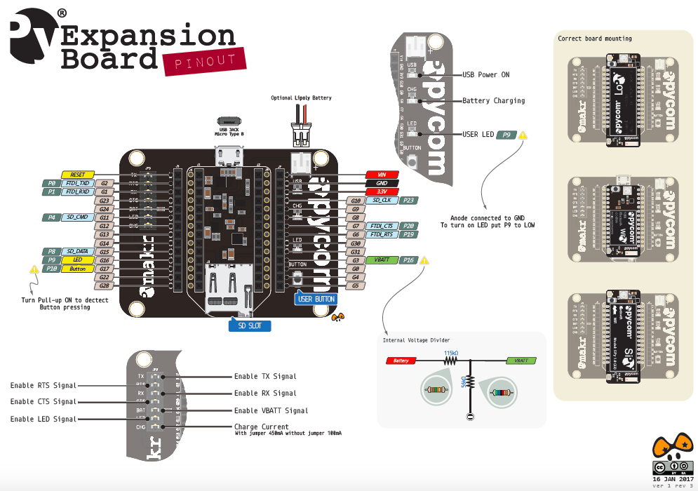

# 6.3.5 Expansion Board 2.0

## Pinout

The pinout of the Expansion Board is available as a [PDF File](https://github.com/pycom/pycom-docs/tree/37661883902849b1a931ee273a23ae8e0f3d773e/chapter/datasheets/downloads/expansion2-pinout.pdf).


Be gentle when plugging/unplugging from the USB connector. Whilst the USB connector is soldered and is relatively strong, if it breaks off it can be very difficult to fix.


## Battery Charger

The Expansion Board features a single cell Li-Ion/Li-Po charger. When the board is being powered via the micro USB connector, the Expansion Board will charge the battery \(if connected\). When the `CHG` jumper is present the battery will be charged at `450mA`. If this value is too high for your application, removing the jumper lowers the charge current to `100mA`.

## Specsheets

The specsheet of the Expansion Board is available as a [PDF File](https://github.com/pycom/pycom-docs/tree/37661883902849b1a931ee273a23ae8e0f3d773e/chapter/datasheets/downloads/expansion2-specsheet.pdf).

