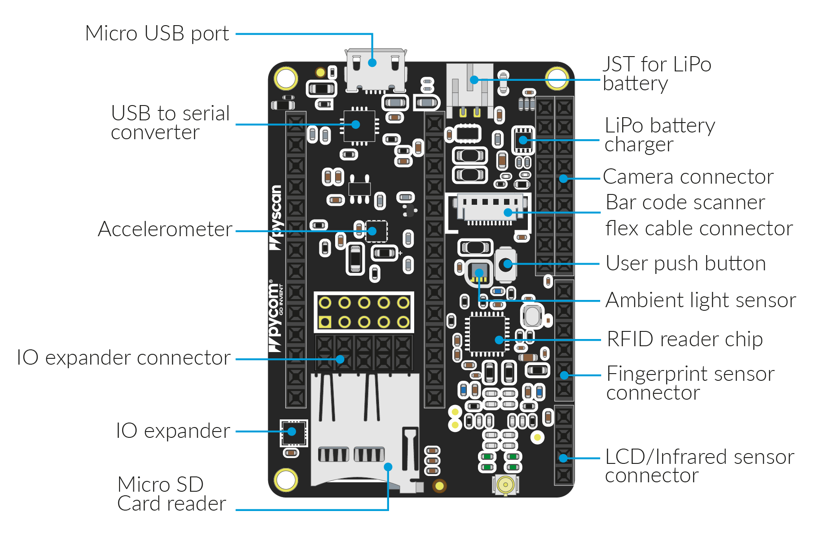

# 6.3.4 Pyscan

## Pyscan Libraries

* Pyscan libraries to use the RFID/NFC reader are located here: [https://github.com/pycom/pycom-libraries/tree/master/pyscan](https://github.com/pycom/pycom-libraries/tree/master/pyscan)
* The accelerometer library is here: [https://github.com/pycom/pycom-libraries/blob/master/pytrack/lib/LIS2HH12.py](https://github.com/pycom/pycom-libraries/blob/master/pytrack/lib/LIS2HH12.py)

For the time being, we recommend to upload the `MFRC630.mpy` file via FTP due to current limitations of Pymakr that will be fixed shortly.

Libraries for the rest of the components will be added soon.

## Pyscan components:

* **Accelerometer**: ST LIS2HH12
* **Ambient light sensor**: Lite-on LTR-329ALS-01
* **RFID/NFC reader**: NXP MFRC63002HN, 151

## Driver

The Windows 7 driver for Pyscan is located in: [https://docs.pycom.io/chapter/pytrackpysense/installation/drivers.html](https://docs.pycom.io/chapter/pytrackpysense/installation/drivers.html) For other Operating Systems there's no driver required.

## Pinout

The pinout of the Pyscan is available as a [PDF File](https://github.com/pycom/pycom-docs/tree/37661883902849b1a931ee273a23ae8e0f3d773e/chapter/datasheets/downloads/pyscan-pinout.pdf).

## Battery Charger

The board features a single cell Li-Ion/Li-Po charger. When the board is being powered via the micro USB connector, it will charge the battery \(if connected\).

## Specsheets

The specsheet of the Pyscan is available as a [PDF File](https://github.com/pycom/pycom-docs/tree/37661883902849b1a931ee273a23ae8e0f3d773e/chapter/datasheets/downloads/pyscan-specsheet.pdf).

