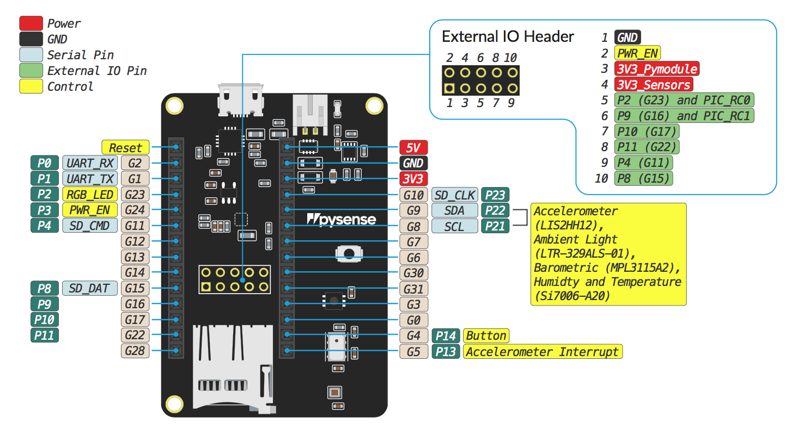

# 6.3.3 Pysense

## Pinout

The pinout of the Pysense is available as a [PDF File](https://github.com/pycom/pycom-docs/tree/37661883902849b1a931ee273a23ae8e0f3d773e/chapter/datasheets/downloads/pysense-pinout.pdf).

## Battery Charger

The board features a single cell Li-Ion/Li-Po charger. When the board is being powered via the micro USB connector, it will charge the battery \(if connected\).

## Specsheets

The specsheet of the Pysense is available as a [PDF File](https://github.com/pycom/pycom-docs/tree/37661883902849b1a931ee273a23ae8e0f3d773e/chapter/datasheets/downloads/pysense-specsheet.pdf).

