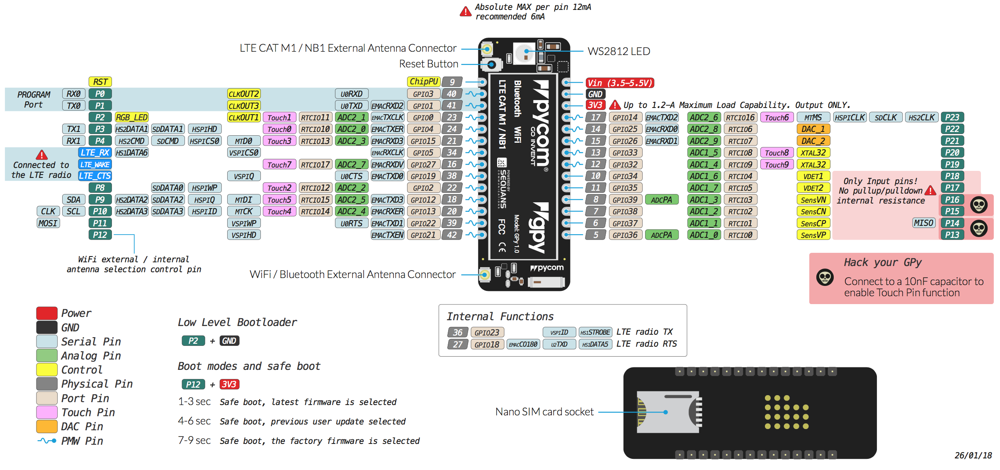

# 6.1.6 GPy

**Store**: [Buy Here](http://www.pycom.io/gpy)

**Getting Started:** [Click Here](https://docs.pycom.io/chapter/gettingstarted/connection/gpy.html)

## Pinout

The pinout of the GPy is available as a [PDF File](https://docs.pycom.io/chapter/datasheets/downloads/gpy-pinout.pdf)


Please note that the PIN assignments for UART1 \(TX1/RX1\), SPI \(CLK, MOSI, MISO\) and I2C \(SDA, SCL\) are defaults and can be changed in Software.


## Datasheet

The datasheet of the GPy is available as a [PDF File](https://docs.pycom.io/chapter/datasheets/downloads/gpy-specsheet.pdf).

The drawing of the LTE-M antenna is available as a [PDF File](../downloads/lte-m-antenna-drawing.pdf).

## Notes

### WiFi

By default, upon boot the GPy will create a WiFi access point with the SSID `gpy-wlan-XXXX`, where `XXXX` is a random 4-digit number, and the password `www.pycom.io`.

The RF switch that selects between the on-board and external antenna is connected to `P12`, for this reason using `P12` should be avoided unless WiFi is disabled in your application.

### Power

The `Vin` pin on the GPy can be supplied with a voltage ranging from `3.5v` to `5.5v`. The `3.3v` pin on the other hand is output **only**, and must not be used to feed power into the GPy, otherwise the on-board regulator will be damaged.

### AT Commands

The AT commands for the Sequans Monarch modem on the GPy are available in a [PDF file](https://docs.pycom.io/chapter/datasheets/downloads/Monarch_4G-EZ_LR5110_ATCommands_ReferenceManual_Rev3_NOCONFIDENTIAL.pdf).

## Tutorials

Tutorials on how to the GPy module can be found in the [examples](https://docs.pycom.io/chapter/tutorials/) section of this documentation. The following tutorials might be of specific interest for the GPy:

* [WiFi connection](https://docs.pycom.io/chapter/tutorials/all/wlan.html)
* [LTE CAT-M1](https://docs.pycom.io/chapter/tutorials/lte/cat_m1.html)
* [NB-IoT](https://docs.pycom.io/chapter/tutorials/lte/nb_iot.html)
* [BLE](https://docs.pycom.io/chapter/tutorials/all/ble.html)

