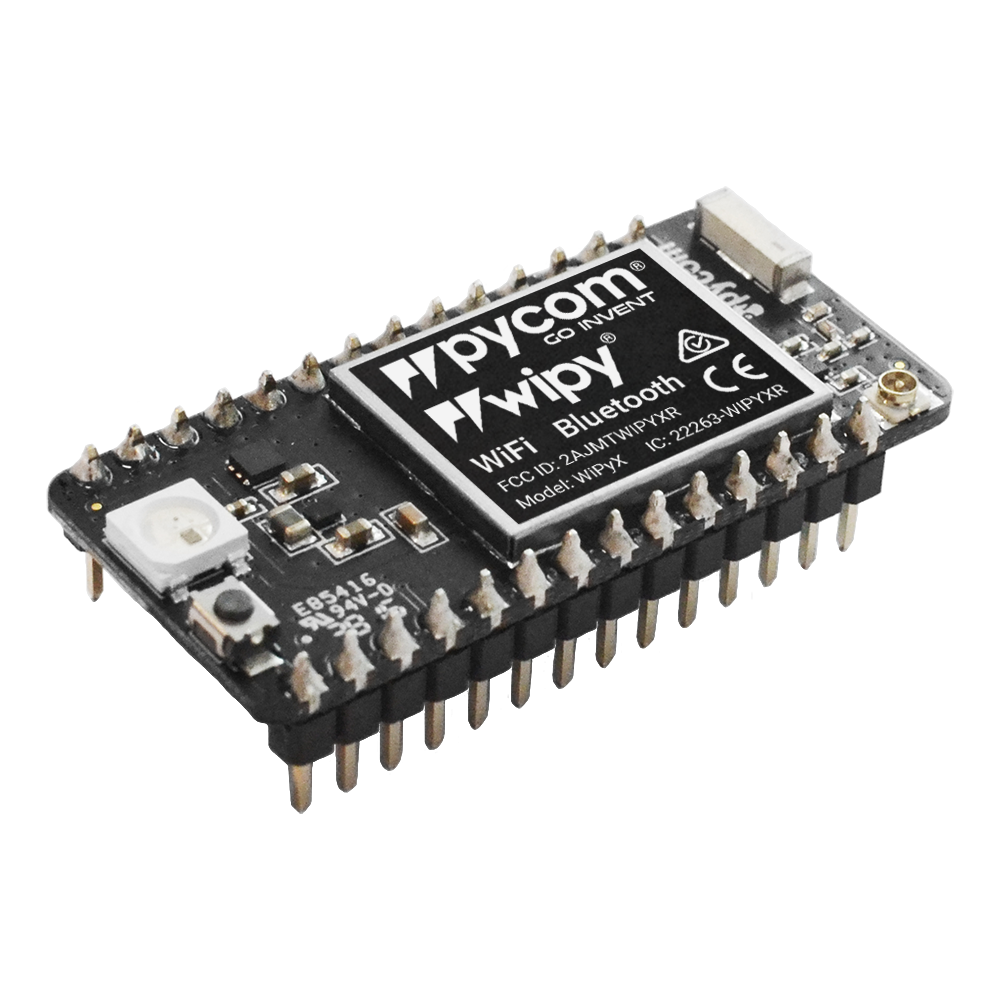
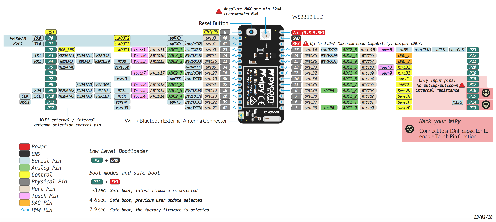

# 6.1.2 WiPy 3.0

## 

**Store**: [Buy Here](http://www.pycom.io/wipy-3)

**Getting Started:** [Click Here](https://docs.pycom.io/chapter/gettingstarted/connection/wipy.html)

## Pinout

The pinout of the WiPy3 is available as a [PDF File](https://docs.pycom.io/chapter/datasheets/downloads/wipy3-pinout.pdf).


Please note that the PIN assignments for UART1 \(TX1/RX1\), SPI \(CLK, MOSI, MISO\) and I2C \(SDA, SCL\) are defaults and can be changed in Software.


## Differences from WiPy 2.0

* Deep sleep current draw fixed, now only 19.7µA
* Upgraded RAM from 512KB to 4MB
* Upgraded External FLASH from 4MB to 8MB
* Antenna select pin moved from GPIO16 to GPIO21 \(P12\)

## Datasheet

The datasheet of the WiPy3 is available as a [PDF File](https://docs.pycom.io/chapter/datasheets/downloads/wipy3-specsheet.pdf).

## Notes

### WiFi

By default, upon boot the WiPy3 will create a WiFi access point with the SSID `wipy-wlan-XXXX`, where `XXXX` is a random 4-digit number, and the password `www.pycom.io`.

The RF switch that selects between the on-board and external antenna is connected to `P12`, for this reason using `P12` should be avoided unless WiFi is disabled in your application.

### Power

The `Vin` pin on the WiPy3 can be supplied with a voltage ranging from `3.5v` to `5.5v`. The `3.3v` pin on the other hand is output **only**, and must not be used to feed power into the WiPy3, otherwise the on-board regulator will be damaged.

## Tutorials

Tutorials on how to the WiPy3 module can be found in the [examples](https://docs.pycom.io/chapter/tutorials/) section of this documentation. The following tutorials might be of specific interest for the WiPy3:

* [WiFi connection](https://docs.pycom.io/chapter/tutorials/all/wlan.html)
* [BLE](https://docs.pycom.io/chapter/tutorials/all/ble.html)

