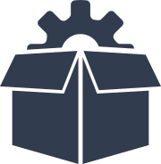

# Pycom Documentation

Welcome to the Pycom documentation site. The documentation is split into 5
sections; we recommend reading through all the sections to familiarise yourself
with the various tools and features available to you to help you develop on
your Pycom module.

To get started, read through the Getting Started Guide then feel free to jump
straight into the tutorials and examples in Tutorials & Examples to begin
building your projects.


  <a href="chapter/products.md">

</a>
  <a href="chapter/gettingstarted/README.md">

</a>
  <a href="chapter/tutorials/README.md">

</a>


  <a href="chapter/products.md">
Products
</a>
  <a href="chapter/gettingstarted/README.md">
Getting Started
</a>
  <a href="chapter/tutorials/README.md">
Tutorials
</a>


  <a href="chapter/datasheets/README.md">

</a>
  <a href="chapter/firmwareapi/README.md">

</a>
  <a href="chapter/pybytes/README.md">

</a>


  <a href="chapter/datasheets/README.md">
Product Info
</a>
  <a href="chapter/firmwareapi/README.md">
API Documentation
</a>
  <a href="chapter/pybytes/README.md">
Pybytes
</a>

