# Pycom Products

## Pycom Products

Below you will find tables of all Pycom products. These tables illustrate the functionality of our various products, their compatibility with each other, as well as what accessories are required to utilise certain functionality.

## Development Boards

| Module | WiFi | Bluetooth | LoRa | Sigfox | LTE CAT-M1   NB-IoT |
| :---: | :---: | :---: | :---: | :---: | :---: |
| [  WiPy 3.0](../6.-product-info/development/wipy3.md) | ✔ | ✔ |  |  |  |
| [  SiPy](../6.-product-info/development/sipy.md) | ✔ | ✔ |  | ✔ |  |
| [  GPy](../6.-product-info/development/gpy.md) | ✔ | ✔ |  |  | ✔ |
| [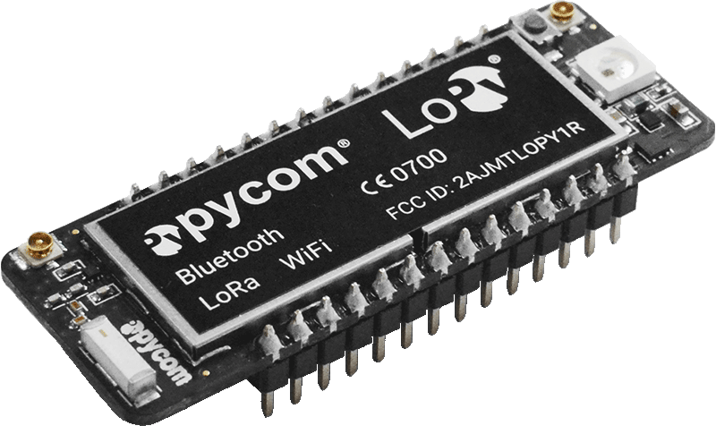  LoPy](../6.-product-info/development/lopy.md) | ✔ | ✔ | ✔ |  |  |
| [  LoPy4](../6.-product-info/development/lopy4.md) | ✔ | ✔ | ✔ | ✔ |  |
| [  FiPy](../6.-product-info/development/fipy.md) | ✔ | ✔ | ✔ | ✔ | ✔ |
| Antennas [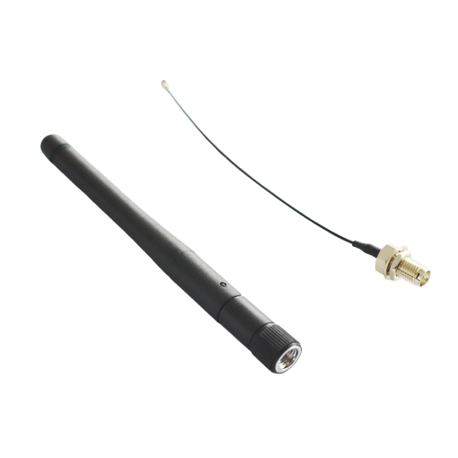  External WiFi/BT   Antenna Kit](https://pycom.io/product/external-wifi-antenna/)[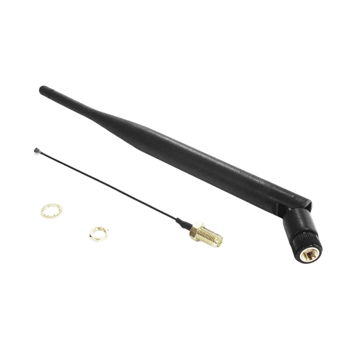  LoRa & Sigfox   Antenna Kit](https://pycom.io/product/lora-antenna-kit/) | [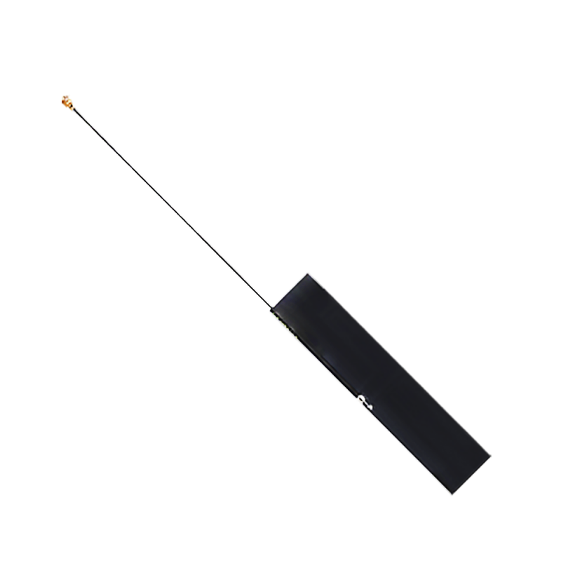  LTE-M   Antenna Kit](https://pycom.io/product/lte-m-antenna-kit/) |  |  |  |  |

## Accessories

| Accessory | [  Expansion Board](../6.-product-info/boards/expansion3.md) | [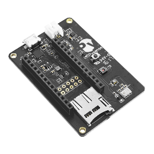  Pysense](../6.-product-info/boards/pysense.md) | [  Pytrack](../6.-product-info/boards/pytrack.md) | [  Pyscan](../6.-product-info/boards/pyscan.md) |
| :---: | :---: | :---: | :---: | :---: |
| [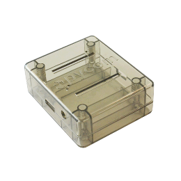  PyCase](https://pycom.io/product/pycase/) | ✔ |  |  |  |
| [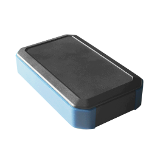  IP67 Case for   Expansion Board](https://pycom.io/product/ip67-expansion-board-case/) | ✔ |  |  |  |
| [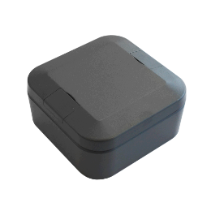  IP67 Case for   Pysense/Pytrack/Pyscan](https://pycom.io/product/ip67-case/) |  | ✔ | ✔ | ✔ |
| [  IP67 Case   \(universal\)](https://pycom.io/product/universal-ip67-case/) | ✔ | ✔ | ✔ | ✔ |
| 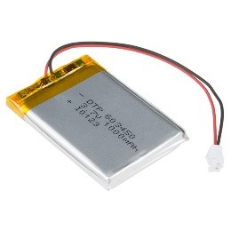  LiPo Battery   \(user-supplied\) | ✔ | ✔ | ✔ | ✔ |
| 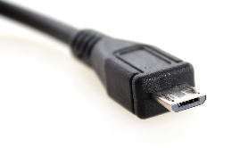  Micro USB Cable   Required   \(user-supplied\) | ✔ | ✔ | ✔ | ✔ |
| Pyscan Modules [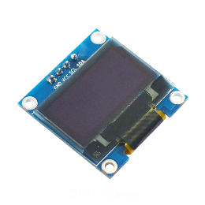  OLED Module](https://pycom.io/product/oled-screen/)[  2MP Camera](https://pycom.io/product/2mp-camera/)[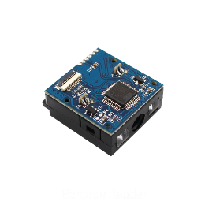  Barcode Reader](https://pycom.io/product/barcode-reader)[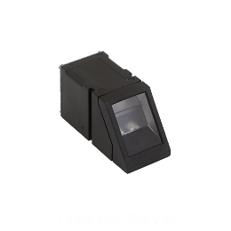  Fingerprint  Scanner](https://pycom.io/product/fingerprint-scanner/)[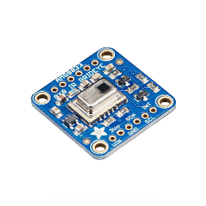  IR Image Sensor](https://pycom.io/product/infared-image-sensor/) | ✔ |  |  |  |

## OEM Modules

| OEM Module | [  L01/W01 Reference Board](../6.-product-info/oem/l01_reference.md) | [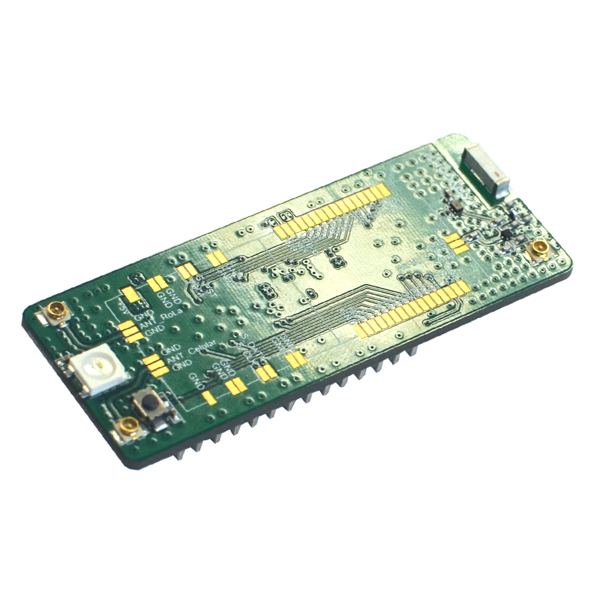  Universal Reference Board](../6.-product-info/oem/universal_reference.md) |
| :---: | :---: | :---: |
| [  W01](../6.-product-info/oem/w01.md) | ✔ | ✔ |
| [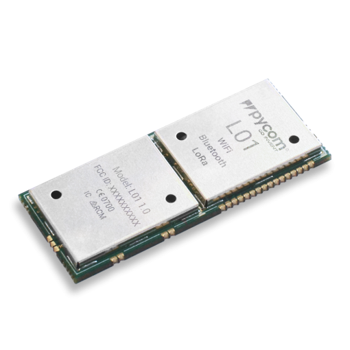  L01](../6.-product-info/oem/l01.md) | ✔ | ✔ |
| [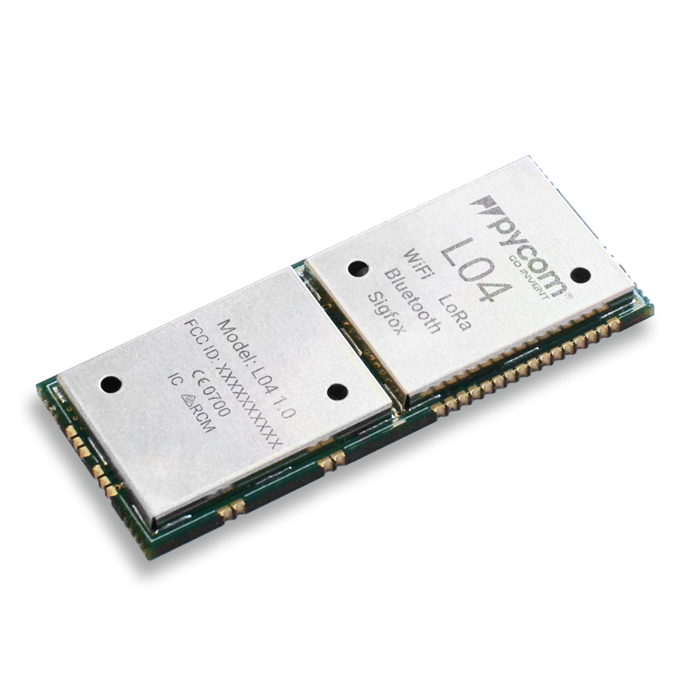  L04](../6.-product-info/oem/l04.md) |  | ✔ |
| [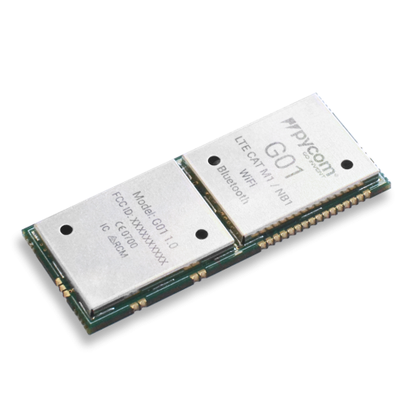  G01](../6.-product-info/oem/g01.md) |  | ✔ |

