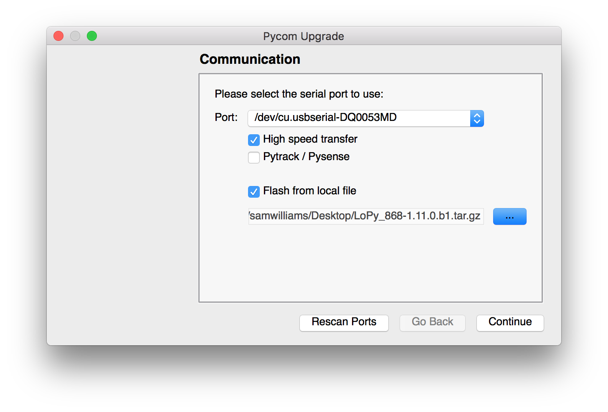

# Firmware Downgrade

The firmware upgrade tool usually updates your device to the latest available
firmware version. If you require to downgrade your device to a previous firmware
there are two methods to achieve this.


If you are using an expansion board 1.0 or 2.0, you will need to have a jumper
connected between `P2` and `GND` to use either procedure below. You will also
need to press the reset button before beginning.


## GUI

As of version `1.12.0.b0` of the firmware update tool, you can now provide a
.tar or .tar.gz archive of the firmware you wish to upload to the board. These
can be aquired [here.]().

When you start the update tool you will see the following screen:

<p></p>

When you tick the `Flash from local file` option, an address bar will appear.
Click the `...` button and locate the .tar(.gz) file with the firmware you wish
to flash to your device. From this point the updater will behave just like a
regular update but using the local file instead of downloading the latest.

## Command line

You can also use the [CLI](./cli.md) version of the update tool to downgrade
your device. Will need to get a .tar or .tar.gz archive of the firmware you
wish to upload to the board. These can be aquired [here.]() Then run the
following commands:

```
$ pycom-fwtool-cli -v -p PORT flash -t /path/to/firmware/archive.tar.gz
```
