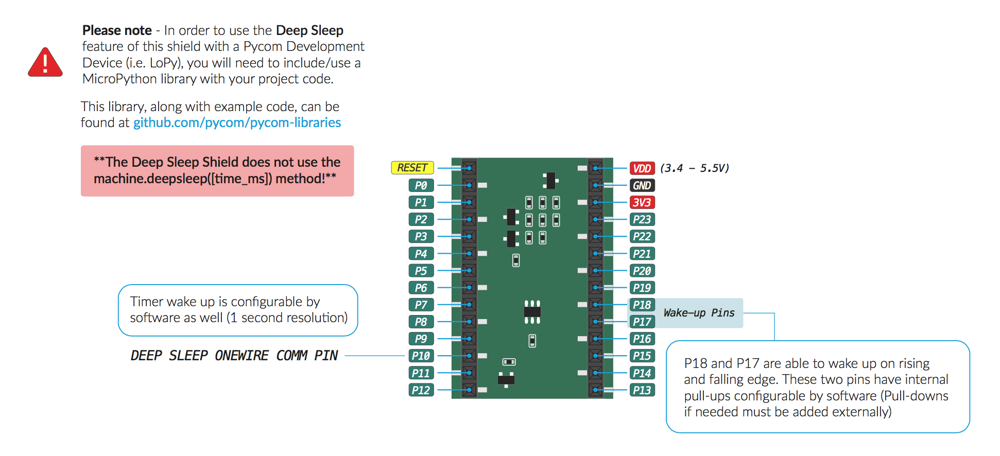
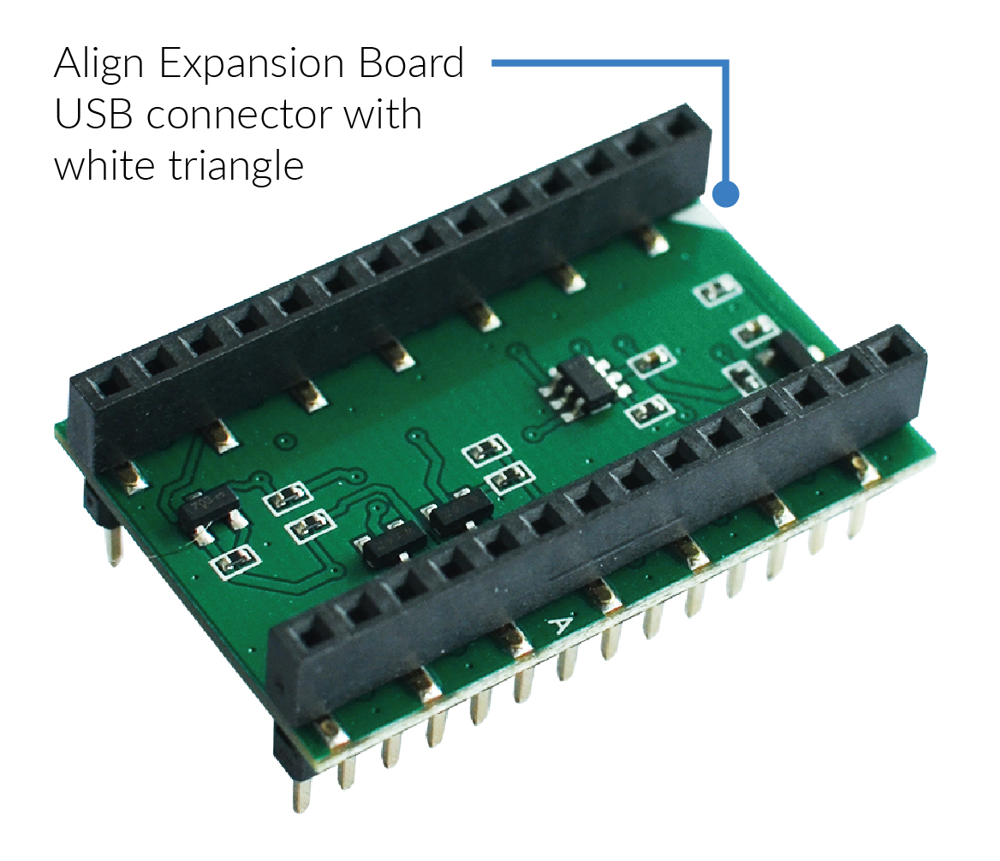

# Deep Sleep Shield

The schematic of the Deep Sleep Shield is available as a <a href="../downloads/deepsleep-schematic.pdf" target="_blank">PDF File</a>.

### Pinout

The pinout of the Deep Sleep Shield is available as a <a href="../downloads/deepsleep-pinout.pdf" target="_blank">PDF File</a>.


To correctly connect a WiPy 2.0, LoPy or SiPy to the Deep Sleep Shield, align the white triangle on the Shield with the LED of the Pycom Device. Once the Pycome Device is seated onto the Deep Sleep Shield, this can then be connected to the Exapnsion Board.


