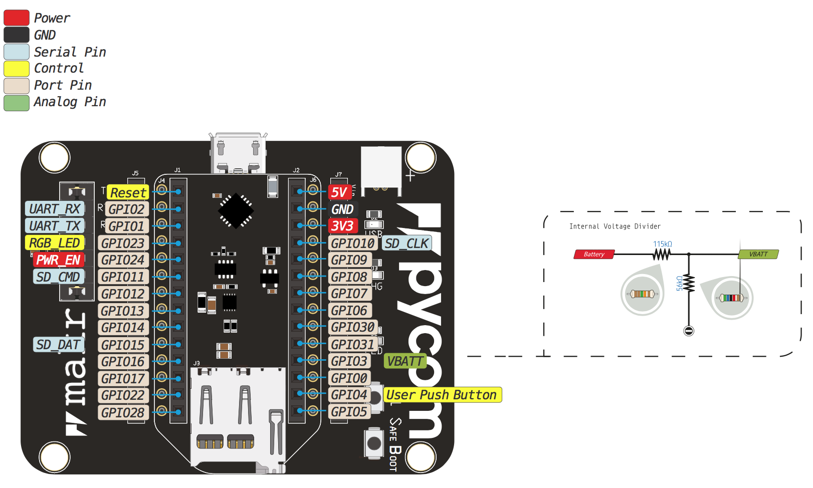

# Expansion Board 3.0

### Pinout

The pinout of the Expansion Board is available as a <a href="../downloads/expansion3-pinout.pdf" target="_blank">PDF File</a>.


Be gentle when plugging/unplugging from the USB connector. Whilst the USB connector is soldered and is relatively strong, if it breaks off it can be very difficult to fix.


### Battery Charger

The expansion board features a single cell Li-Ion/Li-Po charger. When the board is being powered via the micro USB connector, the expansion board will charger the battery (if connected). When the `CHG` jumper is present the battery will be charged at `450mA`. If this value is too high for your application, removing the jumper lowers the charge current to `100mA`.

### Specsheets

The specsheet of the Expansion Board is available as a <a href="../downloads/expansion3-specsheet.pdf" target="_blank">PDF File</a>.

### Differences between v2.0 and v3.0

 - The FTDI chip as been replaced with a custom programmed PIC like on the
   Pysense/Pytrack/Pyscan boards. This allows our firmware update tool to
   automatically put the module into bootloader mode.
 - Added a "Safe boot" button to enter safe boot easier. This button connects
   `P12` to `3.3v` and if pressed and held while the reset button is pressed on
  a pycom module, the module will enter safe boot.
