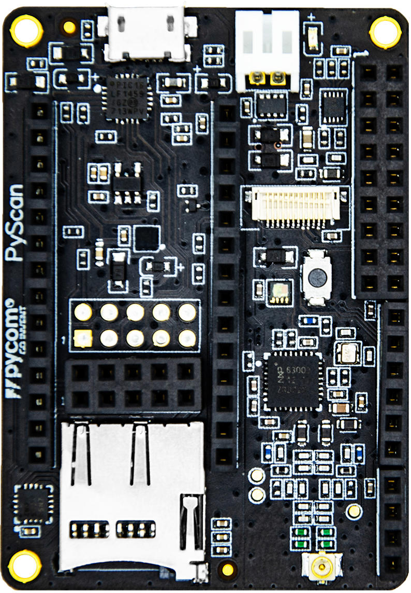

# PyScan

### Pyscan Libraries
Pyscan libraries to use the RFID/NFC reader are located here: https://github.com/pycom/pycom-libraries/tree/master/pyscan
The accelerometer library is here: https://github.com/pycom/pycom-libraries/blob/master/pytrack/lib/LIS2HH12.py

For the time being, we recommend to upload the MFRC630.mpy file via FTP due to current limitations of Pymakr that will be fixed shortly.

Libraries for the rest of the components will be added soon.

### Pyscan components:
**Accelerometer**: ST LIS2HH12
**Ambient ligh sensor**: Lite-on LTR-329ALS-01
**RFID/NFC reader**: NXP MFRC63002HN,151

### Driver
The Windows 7 driver for Pyscna is located in: https://docs.pycom.io/chapter/pytrackpysense/installation/drivers.html
For other Operating Systems there's no driver required.

### Pinout
The pinout of the PyScan is available as a <a href="../downloads/pyscan-pinout.pdf" target="_blank">PDF File</a>.

### Battery Charger

The expansion board features a single cell Li-Ion/Li-Po charger. When the board is being powered via the micro USB connector, the expansion board will charger the battery (if connected).

### Specsheets

The specsheet of the PyScan is available as a <a href="../downloads/pyscan-specsheet.pdf" target="_blank">PDF File</a>.
