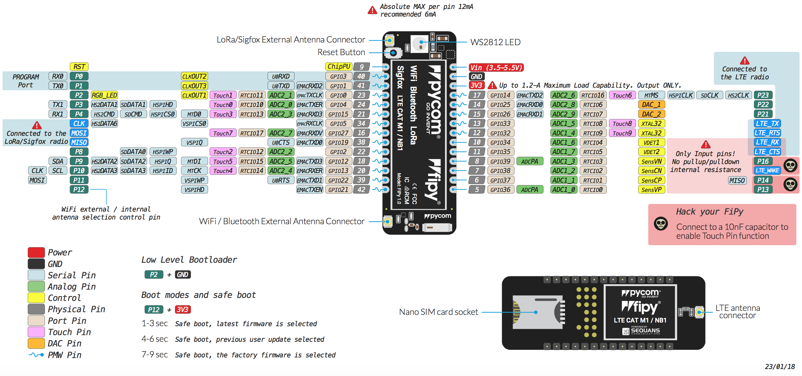

# FiPy

### Pinout
The pinout of the FiPy is available as a <a href="../downloads/fipy-pinout.pdf" target="_blank">PDF File</a>.

 

### Specsheets

The specsheet of the FiPy is available as a <a href="../downloads/fipy-specsheet.pdf" target="_blank">PDF File</a>.

Please note that the PIN assignments for UART1 (TX1/RX1), SPI (CLK,MOSI,MISO) and I2C (SDA,SCL) are defaults and can be changed in Software.
