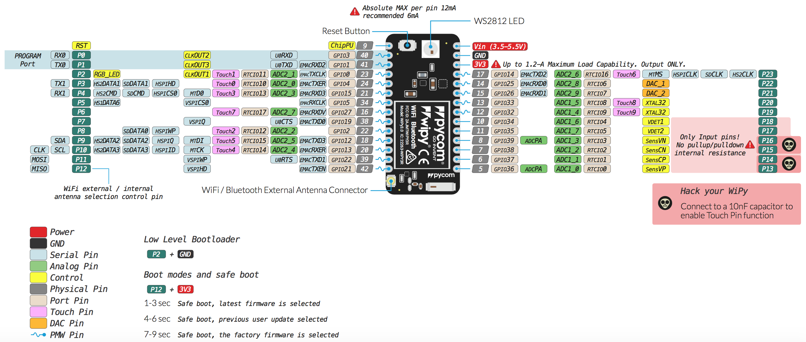

# WiPy 3.0

### Pinout
The pinout of the WiPy 3.0 is available as a <a href="../downloads/wipy3-pinout.pdf" target="_blank">PDF File</a>.

### Differences from WiPy 2.0
 - Upgraded RAM from 512KB to 4MB
 - Upgraded External FLASH from 4MB to 8MB
 - Antenna select pin moved from GPIO16 to GPIO21 (P12)

### Specsheets

The specsheet of the WiPy 3.0 is available as a <a href="../downloads/wipy3-specsheet.pdf" target="_blank">PDF File</a>.

Please note that the PIN assignments for UART1 (TX1/RX1), SPI (CLK,MOSI,MISO) and I2C (SDA,SCL) are defaults and can be changed in Software.
