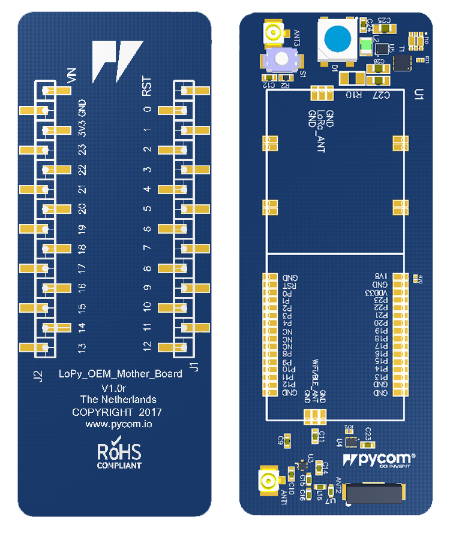

# L01 reference design

The L01 OEM reference board is a reference design suitable L01 as well as W01
making it possible to have a single PCB design that can accommodate both OEM
modules.


If you require a reference board for the L04 or G01, this design is **not**
suitable as it does not feature a SIM slot or the double antenna connection.
For the G01 or L04 please use the
[Universal OEM Baseboard Reference](./universal_reference.md)


## Features
 - Suits both L01 or W01 OEM Modules
 - U.FL connector for the L01's LoRa output.
 - On-board 2.4GHz antenna for WiFi and Bluetooth, with the ability to switch
 to a external antenna via a U.FL connector.
 - WS2812B RGB LED
 - 3.5-5.5 Input switch mode DC-DC regulator with low current draw during deep
 sleep
 - Reset button

## Layout
The layout of the L01 baseboard reference is available as a
<a href="../downloads/l01-oem-layout.pdf" target="_blank">PDF File</a>.

## Schematic
The schematic of the L01 baseboard reference is available as a
<a href="../downloads/l01-oem-schematic.pdf" target="_blank">PDF File</a>.

## Altium Project and Gerber Files
The Altium Project and Gerber files are also available as a
<a href="../downloads/l01-oem-baseboard-ref.zip" target="_blank">ZIP File</a>.
