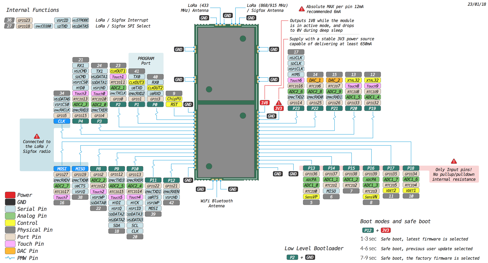

# L04

### Pinout
The pinout of the L04 is available as a <a href="../downloads/l04-pinout.pdf" target="_blank">PDF File</a>.

### Specsheets

The specsheet of the L04 is available as a <a href="../downloads/l04-specsheet.pdf" target="_blank">PDF File</a>.

### Drawings

The drawings for the L04 is available as a <a href="../downloads/l04-drawing.pdf" target="_blank">PDF File</a>.

Please note that the PIN assigments for UART1 (TX1/RX1), SPI (CLK,MOSI,MISO) and I2C (SDA,SCL) are defaults and can be changed in Software.
