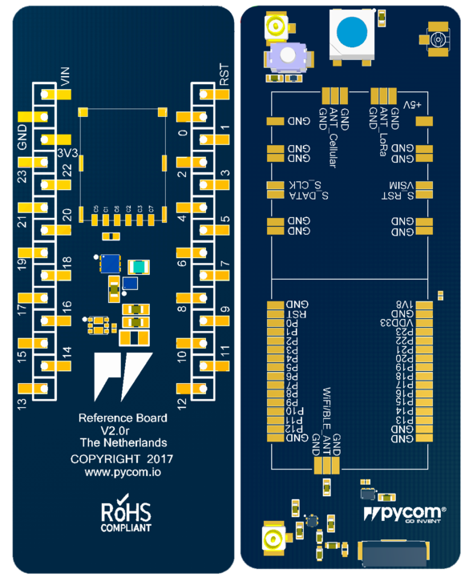

# OEM Baseboard Reference Design Files

## Layout
The layout of the OEM baseboard reference is available as a <a href="../downloads/oem-universal-layout.pdf" target="_blank">PDF File</a>.

## Schematic
The schematic of the OEM baseboard reference is available as a <a href="../downloads/oem-universal-schematic.pdf" target="_blank">PDF File</a>.

## Altium Project and Gerber Files

The Altium Project and Gerber files are also available as a <a href="../downloads/oem-universal-baseboard-ref.zip" target="_blank">ZIP File</a>.



This layout is universal and should accommodate the W01, L01, L04 and G01 OEM modules, making it possible to have a single PCB design that can accommodate all our OEM modules.


