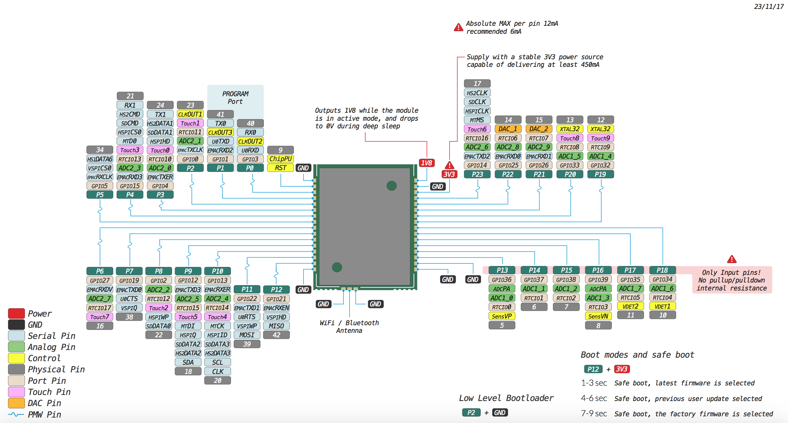

# W01

### Pinout
The pinout of the W01 is available as a <a href="../downloads/w01-pinout.pdf" target="_blank">PDF File</a>.

### Specsheets

The specsheet of the W01 is available as a <a href="../downloads/w01-specsheet.pdf" target="_blank">PDF File</a>.

### Drawings

The drawings for the W01 is available as a <a href="../downloads/w01-drawing.pdf" target="_blank">PDF File</a>.

Please note that the PIN assigments for UART1 (TX1/RX1), SPI (CLK,MOSI,MISO) and I2C (SDA,SCL) are defaults and can be changed in Software.
