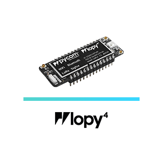
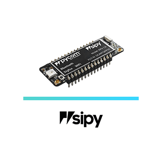
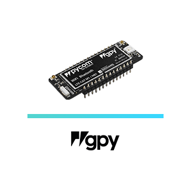
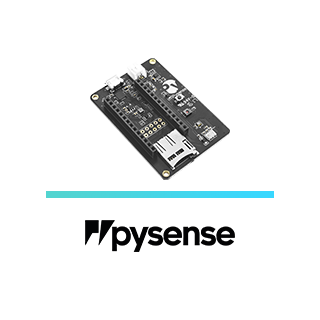
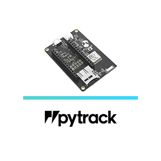

# Getting Started
So, you've decided to order a Pycom development module. Firstly we would like to
congratulate you in making an excellent decision. If you haven't yet placed your
order we highly recommend you check out the [requirements](./requirements.md)
page before you place your order to ensure you know which accessories you might
require.

## Products
Click the picture matching your product below to be taken to its getting started
guide.


  <a href="connection/wipy.md">

</a>
  <a href="connection/lopy.md">

</a>
  <a href="connection/lopy4.md">

</a>


  <a href="connection/sipy.md">

</a>
  <a href="connection/gpy.md">

</a>
  <a href="connection/fipy.md">

</a>


  <a href="connection/pysense.md">

</a>
  <a href="connection/pytrack.md">

</a>

