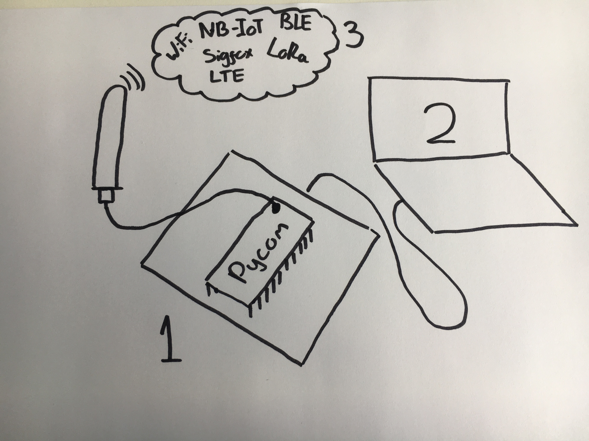

# Getting Started
So, you've decided to order a Pycom development module. Firstly we would like to
congratulate you in making an excellent decision. If you haven't yet placed your
order we highly recommend you check out the [requirements](./requirements.md)
page before you place your order to ensure you know which accessories you might
require.

##[Step 1: Getting the hardware setup](hardwaresetup.md)
In the first part of this getting started guide, we will take you through
setting up your device. Firstly we will cover how to connect the module to your
computer either via USB or WiFi. Secondly we will explain how to connect various
accessories such as antennas or SIM cards to your module.

##[Step 2: Getting your computer setup](installingsoftware.md)
Now that your module is successfully connected, you will need to install some
software on your computer to interface with it. The second part of this guide
will guide you through installing drivers; performing firmware updates for your
module/accessories to ensure you have the most stable and feature packed version;
and how to setup the software use to program the device.

##[Step 3: Using your module](micropython.md)
Now that you have a connected module and all the required software installed it
is time to begin programming your device. This part of the guide will get you
started with a basic example and point you in the right direction for getting
your device connected to your chosen network.


You can navigate through this guide using the arrow buttons on the left and right
of the screen (or at the bottom if you are using mobile).

