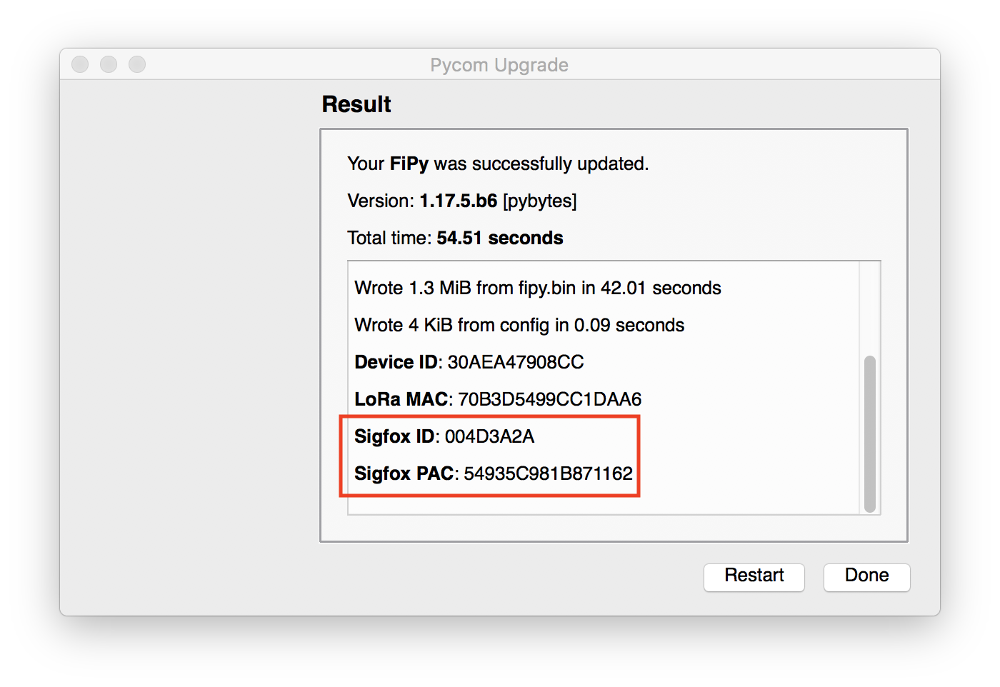
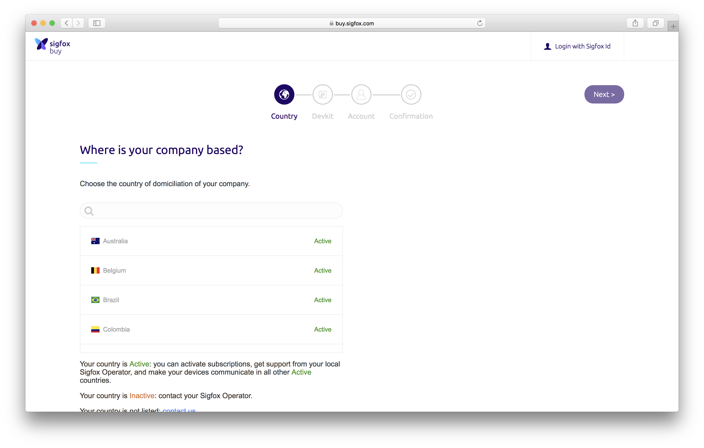
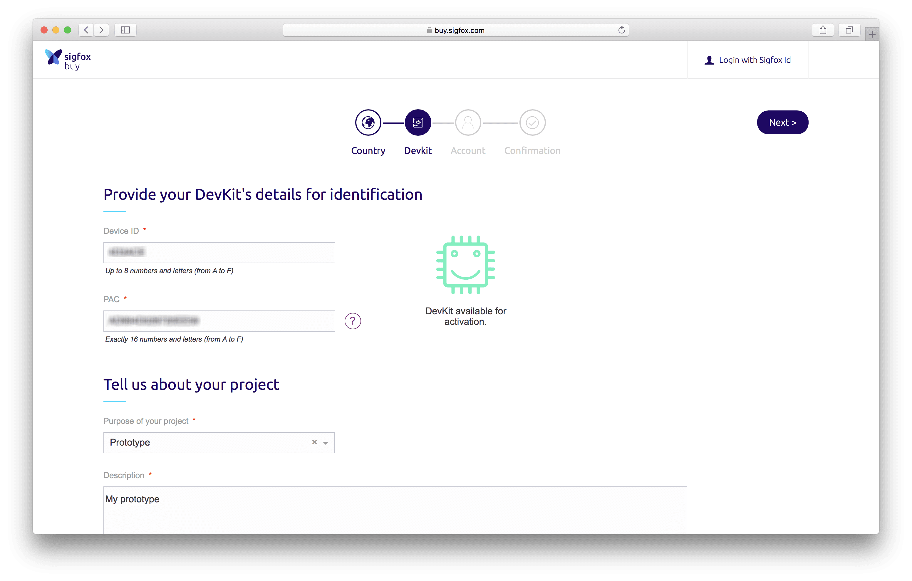
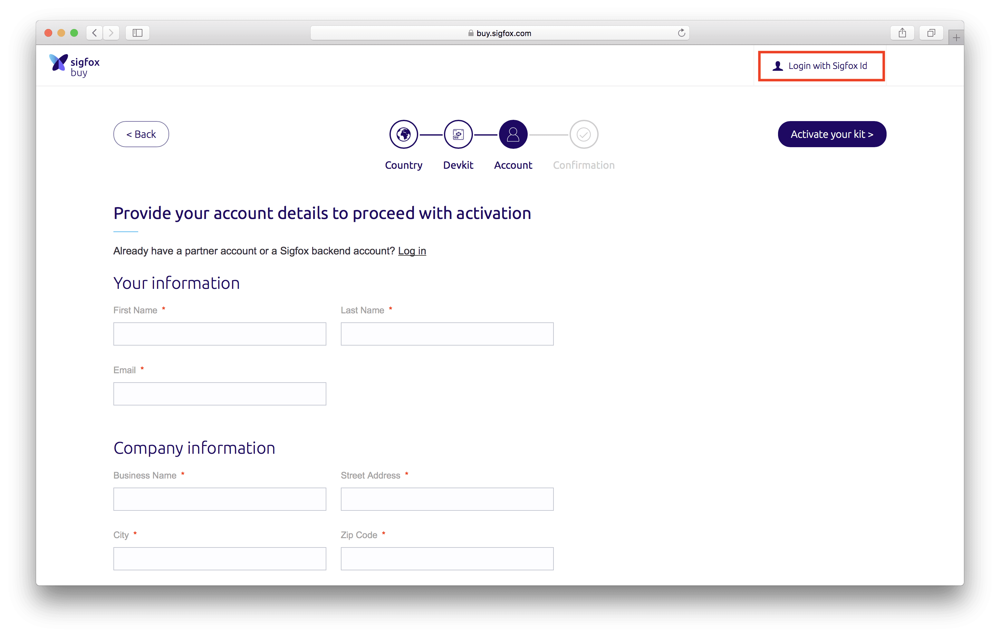
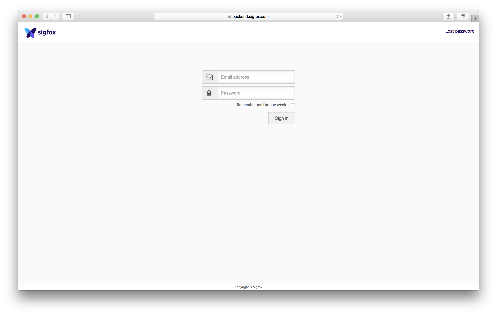
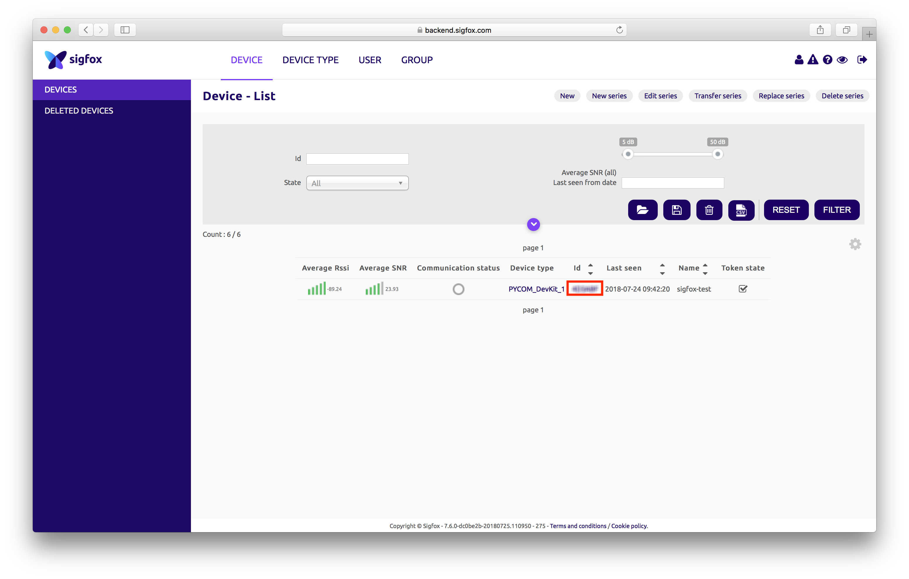
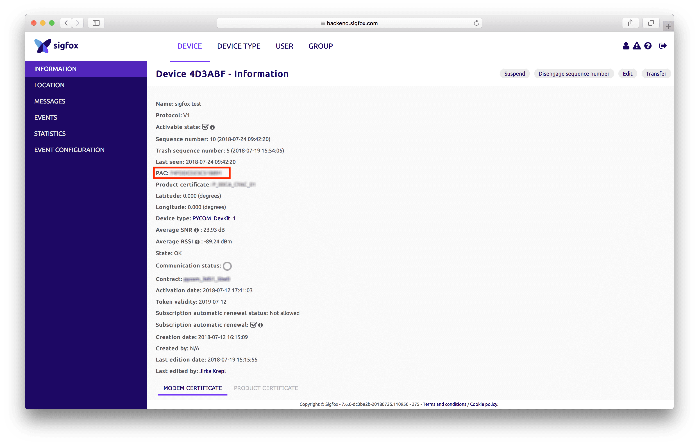

# Registering device at Sigfox Backend

Before you start, update your device to the latest firmware. Select *stable* firmware in Firmware updater.
After firmware update is done, *Sigfox ID* and *Sigfox PAC* were assigned to your device.

Copy *Sigfox ID* and *Sigfox PAC* from the last screen of firmware updater.

<p align="center"></p>

*Sigfox ID* and *Sigfox Pac* is assigned to your device just once during the first update process.
*Sigfox ID* and *Sigfox Pac* will not change after successive firmware updates.

After first firmware update you can also get your *Sigfox ID* and *Sigfox PAC* through a couple of commands via the REPL.

```python
from network import Sigfox
import binascii

# initalise Sigfox for RCZ1 (You may need a different RCZ Region)
sigfox = Sigfox(mode=Sigfox.SIGFOX, rcz=Sigfox.RCZ1)

# print Sigfox Device ID
print(binascii.hexlify(sigfox.id()))

# print Sigfox PAC number
print(binascii.hexlify(sigfox.pac()))
```

## Creating account at Sigfox backend
You need to register to the Sigfox Backend. Navigate to https://backend.sigfox.com/activate

<p align="center"></p>

Find the specific country country where the device will be activated.
Enter the device's *Sigfox ID* and *Sigfox PAC*.

You should see green microchip if you entered correct  *Sigfox ID* and *Sigfox PAC*

<p align="center"></p>

Then provide the required information including email address and complete registration.


When registering your other devices (not your first device), you already have created Sigfox Account before.
Be sure you are login with your Sigfox account. In that way all of your devices will be added to same Sigfox Account.


<p align="center"></p>

After registration, you will receive confirmation email with *password* to Sigfox backend https://backend.sigfox.com/auth/login

Use your email and password to login to Sigfox backend.

<p align="center"></p>

If you enter correct credentials then you should be able to login to Sigfox backend.

## Transferring your device to new Sigfox account

You may want to transfer your devices to new Sigfox account.

Once you register your device on Sigfox backend, then your Sigfox PAC was used, and is not valid anymore.
You need to get new Sigfox PAC.
We don't update Sigfox PAC assigned to your device (which can be seen on last page of Firmware updater or read from device).

To get new Sigfox PAC navigate to your device on Sigfox backend. On *device* click on Sigfox Id of device you want to transfer.

<p align="center"></p>

Now you can see your new Sigfox PAC.

<p align="center"></p>

Once you know your new Sigfox PAC go to https://backend.sigfox.com/activate and register device with different account.
