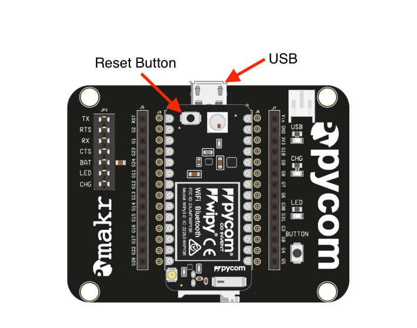
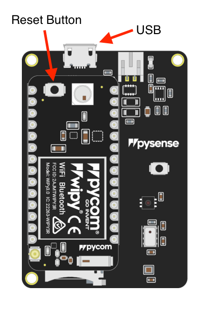
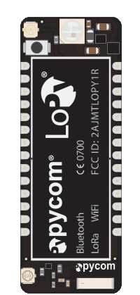

# Connecting your device

Lets get started setting up the Pycom device. The easiest method to
programming/using a Pycom device is with the Pycom Expansion Board, PySense or
PyTrack.

Select below the tab that matches your configuration for a step by
step guide.





- Look for the reset button on the module (located at a corner of the board,
  next to the LED).
- Locate the USB connector on the expansion board.
- Insert the module on the expansion board with the reset button pointing towards the USB connector. It should firmly click into place and the pins should now no longer be visible.
- It’s that simple! For confirmation, here’s a picture demonstrating how to correctly align a Pycom device with the expansion board:


- Before connecting your module to a PySense/PyTrack board, you should update
  the firmware on the PySense/PyTrack. Instructions on how to do this can be
  found [here](../pytrackpysense/installation/firmware.md).
- Look for the reset button on the module (located at a corner of the board,
  next to the LED).
- Locate the USB connector on the PySense/PyTrack.
- Insert the module on the PySense/PyTrack with the reset button pointing towards the USB connector. It should firmly click into place and the pins should now no longer be visible.
- It’s that simple! For confirmation, here’s a picture demonstrating how to correctly align a Pycom device with the Pysense/Pytrack:



#### Video Tutorial


https://youtu.be/wUxsgls9Ymw



Some devices, such as the LoPy, will cover the USB connector. This is normal; remember to keep the orientation as shown in the image above.


### Looking After Your Device
To ensure the longevity of your expansion board, please be aware of the following:

- Be gentle when plugging/unplugging the USB cable. Whilst the USB connector is soldered and relatively strong, it can break off and will be difficult to fix.
- Static electricity can damage components on the board and may destroy them. If there is a lot of static electricity in the area (e.g. dry and cold climates), take extra care not to shock the device. If the device came in a ESD bag (Silver packaging), the best way to store and carry the device is inside this bag as it will be protected against static discharges.

## Connecting via USB

Once everything is in place, the device is ready to be programmed. Plug it into a USB socket (either to a computer or using an external battery).

In a few seconds, the LED should start blinking every 4 seconds. This means that everything is working correctly! If the LED is not blinking, please disconnect the power supply and re-check the board’s position on the expansion board.

