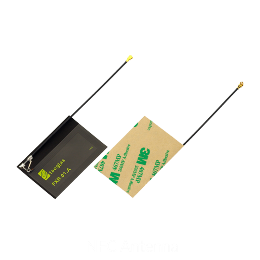

# Pycom Products

This documentation is applicable for all of the devices below. To find out more about these products and where to buy them, visit the [Pycom Webshop](https://pycom.io).

# Development Boards
| Module | WiFi | Bluetooth | LoRa | Sigfox | LTE CAT-M1   NB-IoT |
| :----: | :--: | :-------: | :--: | :----: | :--------------------: |
|   WiPy 3.0 | ✔ | ✔ |   |   |   |
|   SiPy      | ✔ | ✔ |   | ✔ |   |
|   GPy        | ✔ | ✔ |   |   | ✔ |
|   LoPy      | ✔ | ✔ | ✔ |   |   |
|   LoPy4    | ✔ | ✔ | ✔ | ✔ |   |
|   FiPy      | ✔ | ✔ | ✔ | ✔ | ✔ |
| Antennas <td colspan=2 align="center">   External WiFi   Antenna Kit <td colspan=2 align="center">   LoRa & Sigfox   Antenna Kit |   LTE-M   Antenna Kit |

# Accessories
| Accessory |   Expansion Board |   Pysense |   Pytrack |   Pyscan |
| :-------: | :-------------: | :-----: | :-----: | :----: |
|   PyCase | ✔ ||||
|   IP67 Case for   Expansion Board | ✔ ||||
|   IP67 Case for   Pysense/Pytrack || ✔ | ✔ ||
|   IP67 Case   (universal) | ✔ | ✔ | ✔ | ✔ |
|   LiPo Battery   (user-supplied) | ✔ | ✔ | ✔ | ✔ |
|   Micro USB Cable   (user-supplied) | ✔ | ✔ | ✔ | ✔ |
| Pyscan Modules <td colspan=3 align="center" style="padding:0"> <table style="margin:0"><tr style="border-top:none"><td align="center" style="border:none">  OLED Module</td><td align="center" style="border:none">  2MP Camera</td><td align="center" style="border:none">  Barcode Reader</td><tr style="background-color: #FFF; border-top:none"><td align="center" style="border:none">  Fingerprint   Scanner</td><td align="center" style="border:none">  IR Image Sensor</td><td align="center" style="border:none">  NFC Antenna</td> | ✔ |

# OEM Modules

| OEM Module |   L01/W01 Reference Board |   Universal Reference Board |
| :--------: | :-------------: | :-----: |
|   W01 | ✔ | ✔ |
|   L01 | ✔ | ✔ |
|   L04 |   | ✔ |
|   G01 |   | ✔ |
