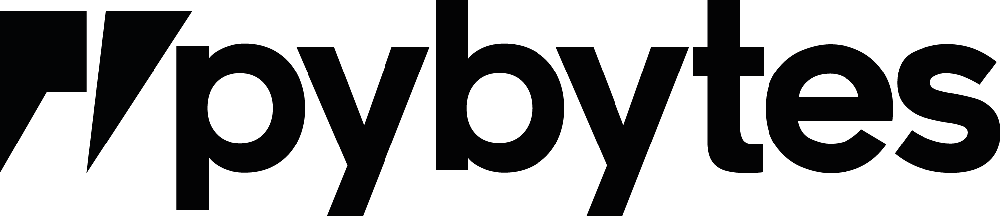
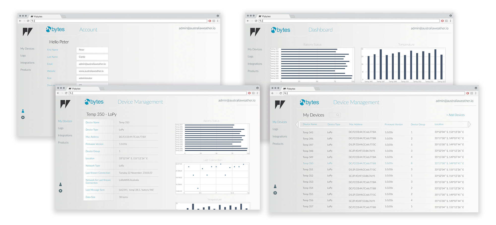

# Pybytes Beta

Pybytes is Pycom's middleware platform available for all Pycom modules (Summer 2017). Pycom is running the Closed Beta from June through to the beginning of August.  The first full version of Pybytes is targeted for a late August 2017 release. Please read the following sections for more information about how to get started using the middleware platform.

