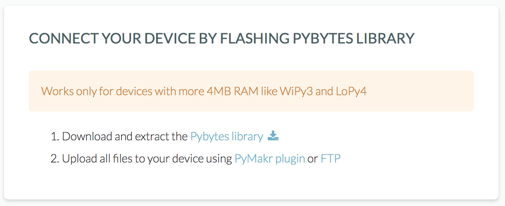
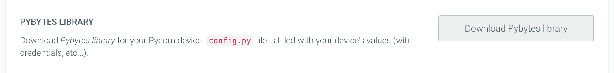

# Connecting to Pybytes by flashing Pybytes library manually


From firmware 1.16.x onwards all Pycom devices come with Pybytes library build-in `/frozen` folder.
That means that you can add your device quickly without the need of flashing Pybytes library manually. [Click here if you want more information.](quick.md)

Still, if you want to extend Pybytes library or add your code `main.py` file you have an option to
flash Pybytes library manually.

Pybytes library written to `/flash` folder and will take precedence over build in firmware libraries
in `/frozen` folder.


## Step 1: Add Device Wizard
On ``Devices`` Page:

1. Click on ``Add Device``.

2. Select your device (e.g., WiPy, LoPy, SiPy, etc.);

3. Select your shield (e.g., PySense, PyTrack, PyScan or other);

4. Select your network option;

5. Enter a unique name and the network credentials (SSID and password) for your device;

6. Click on download *Pybytes library* link in last step.

### Already added device
You can also download the pybytes library after adding your device to Pybytes:

1. Navigate to your device in Pybytes
2. Click on settings tab
3. Click on *Download Pybytes library* button.

## Step 2. Flash your device with Pymakr


In case you haven't installed Pymakr plugin:
Follow [these instructions](../../pymakr/installation/atom.md).
Please skip [Initial Configuration](../../pymakr/installation/atom.md#initial-configuration) section.


1. Connect your device to your computer with USB cable.
2. Extract download Pybytes library and open extracted folder with Atom.
3. Get your device serial port: in Pymakr plugin click on *More* > *get serial ports*
4. Paste your device's serial port to `pymakr.conf` file:
        {
            "address": "PASTE_YOUR_SERIAL_PORT_HERE",
            "username": "micro",
            "password": "python",
            "sync_folder": "flash"
        }
5. Checkout your `flash/config.py` file. It will be pre-filled with your information from Pybytes
Like deviceToken or WiFi credentials. You can change e.g. your WiFy password here.
6. Put your device in [safe boot mode](../../toolsandfeatures/bootmodes.md#safe-boot).
7. Upload code to your device by clicking on *Upload* button in Pymakr.
After all Pybytes library files are uploaded to device, device will restart and will connect to Pybytes.

# Next step: Set up your device's dashboard!
Now it's time to display data from your device into Pybytes dashboard. You can check more about it [here!](../dashboard/intro.md)
