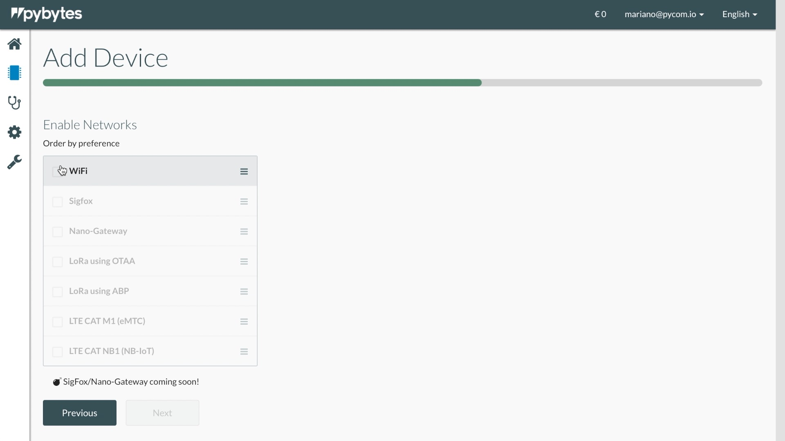
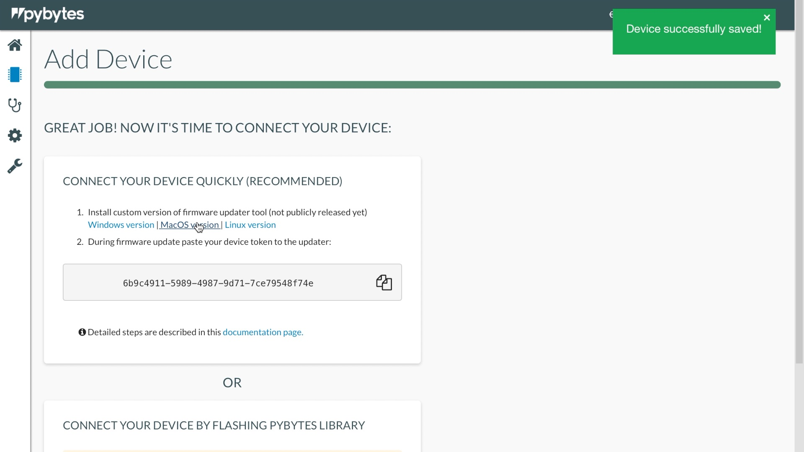
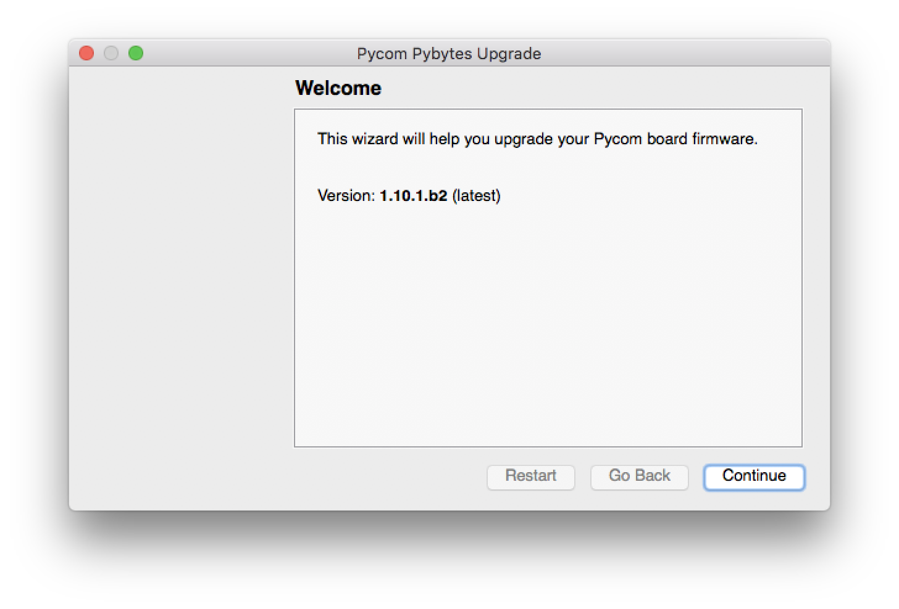
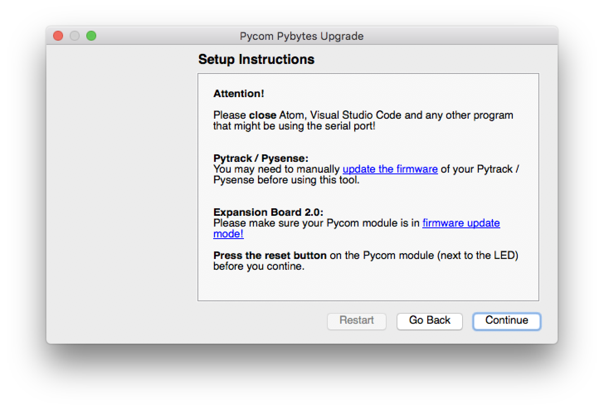
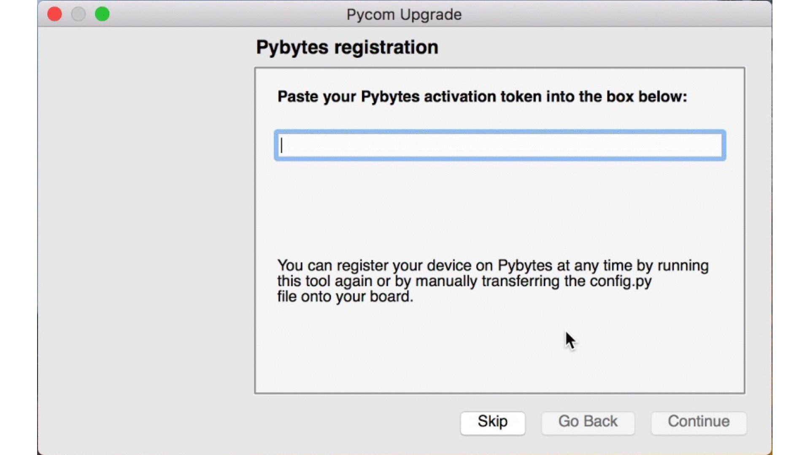

# Connecting your Pycom module to Pybytes

In this section, we will explain to you how to connect your device to Pybytes quickly.


In case you want to extend Pybytes library you can flash Pybytes library manually. [Click here if you want more information.](flash.md)


## Step 1: Add Device Wizard
On ``Devices`` Page:

1. Click on ``Add Device``.

2. Select your device (e.g., WiPy, LoPy, SiPy, etc.);

3. Select your shield (e.g., PySense, PyTrack, PyScan or other);

4. Select your network option;

5. Enter a unique name and the network credentials (SSID and password) for your device;

6. Download the firmware updater for your operating system and copy the device token.

## Step 2: Firmware updater
Install the Firmware updater on your computer.

1. Start the ``Firmware updater``;

2. Select your device serial port (Make sure your device is connected to your computer);

3. Mark the options "Erase flash file system" and "Force update Pybytes registration";

4. Paste your device token from Pybytes;

5. The firmware updater will update the device's firmware.

# Next step: Set up your device's dashboard!
Now it's time to display data from your device into Pybytes dashboard. You can check more about it [here!](../dashboard/intro.md)
