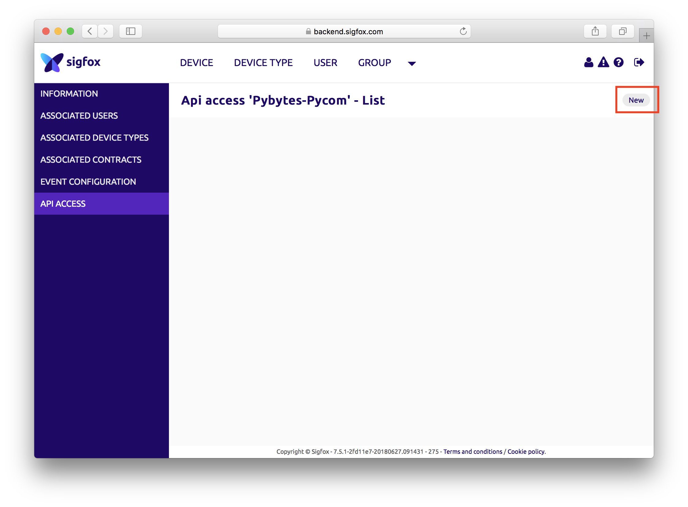
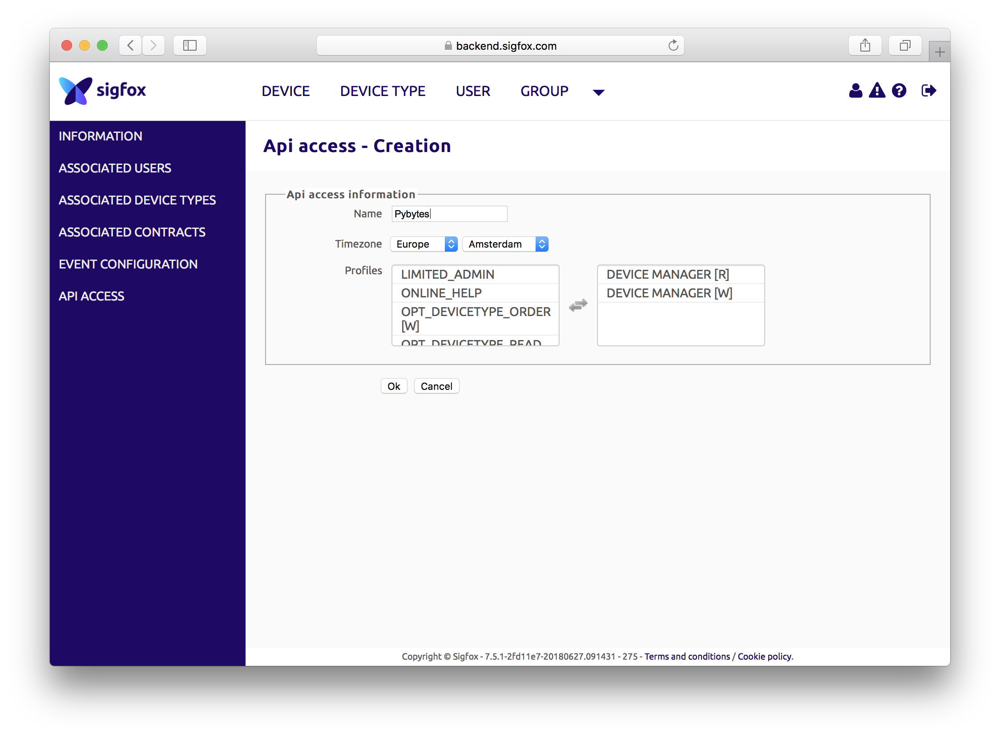
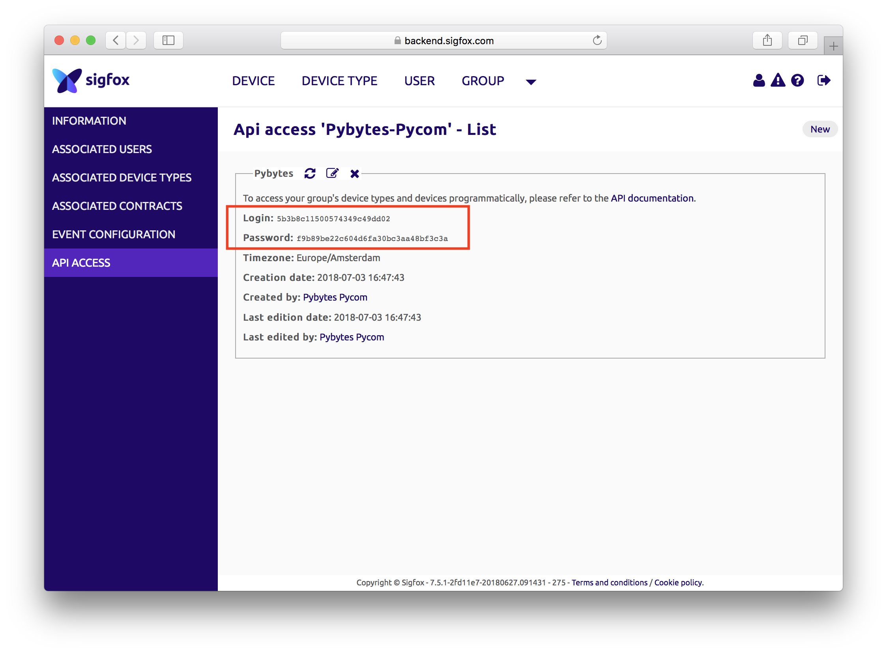
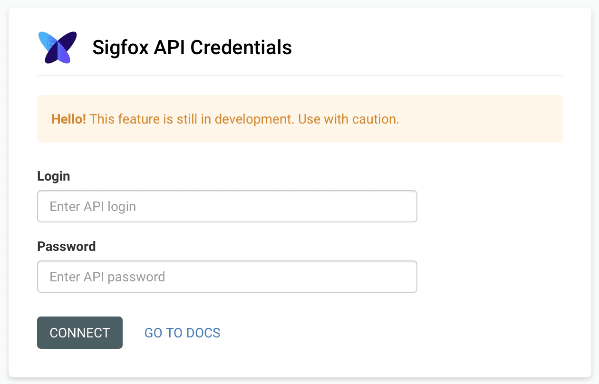

# Add Sigfox device


Before you start you need to register your Sigfox account at **[Sigfox backend](../../gettingstarted/registration/sigfox.md)**.
You need Pycom device with Sigfox connectivity to get your Sigfox account.


## Create Sigfox API credentials

Once you have you account setup and are logged in Sigfox backend, you need to create API credentials for Pybytes.

Click on GROUP &rarr; `<YOUR COMPANY NAME>` &rarr; API ACCESS &rarr; New

In the form chose arbitrary *name*, select Profiles `DEVICE MANAGER [R]` and `DEVICE MANAGER [W]`.
Then click on Ok.

Copy *Login* and *Password* to the clipboard.

Paste *Login* and *Password* to the Pybytes Sigfox credentials page.

## Add Sigfox device in Pybytes

1. Create Sigfox device (Lopy4, SiPy, FiPy) in Pybytes
2. Activate device with the firmware updater.


Detailed steps which are same for all devices are described **[here](./quick.md)**.


