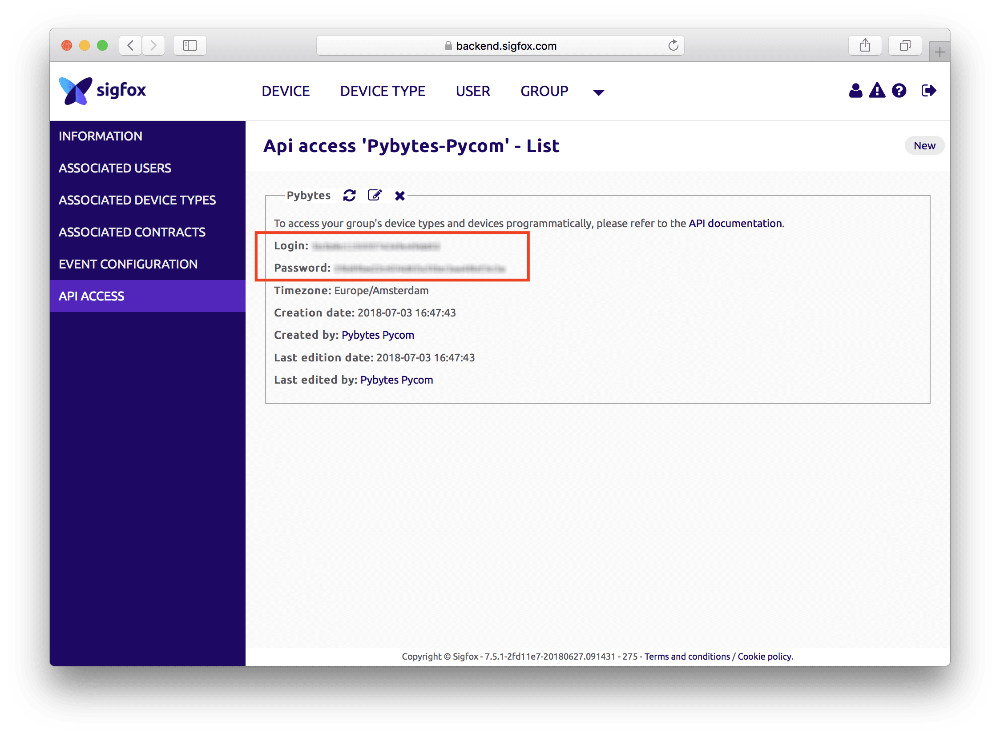

# Add Sigfox device


Before you start you need to create Sigfox account.
You need Pycom device with Sigfox to get your Sigfox account. **[Follow these instructions](../../gettingstarted/registration/sigfox.md)** first please.


## Create Sigfox API credentials

Once you have you account setup and are logged in Sigfox backend, you need to create API credentials for Pybytes.

Click on GROUP &rarr; `<YOUR COMPANY NAME>` &rarr; API ACCESS &rarr; New

In the form chose arbitrary *name*, select Profiles `DEVICE MANAGER [R]` and `DEVICE MANAGER [W]`.
Then click on Ok.

Copy *Login* and *Password* to the clipboard.

In Pybytes go to Settings &rarr; Sigfox API or [follow this link](https://pybytes.pycom.io/settings/sigfox-credentials) then paste in the form.

## Sigfox account types

### Sigfox DevKit contracts

Every Pycom device with Sigfox connectivity comes with Sigfox DevKit account.
You are provided with one year of free connectivity for your device. This is great for prototyping.

For every new device you would need to repeat [Sigfox activation procedure](../../gettingstarted/registration/sigfox.md)

Downside is that for every device you want to add to Pybytes,

* you cannot use just Pybytes to add new devices
* every device is added new Device

### Sigfox custom contracts

* paid
* use just Pybytes to quickly add new Sigfox devices

1. Create Sigfox device (Lopy4, SiPy, FiPy) in Pybytes
2. Activate device with the firmware updater.


Detailed steps which are same for all devices are described **[here](./quick.md)**.


