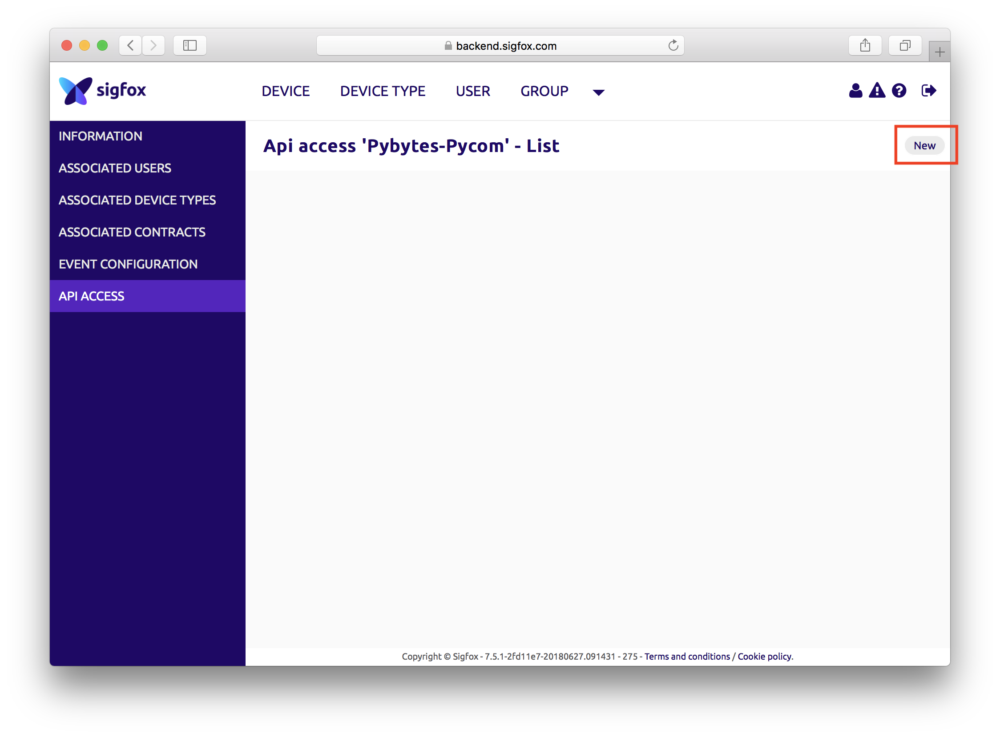
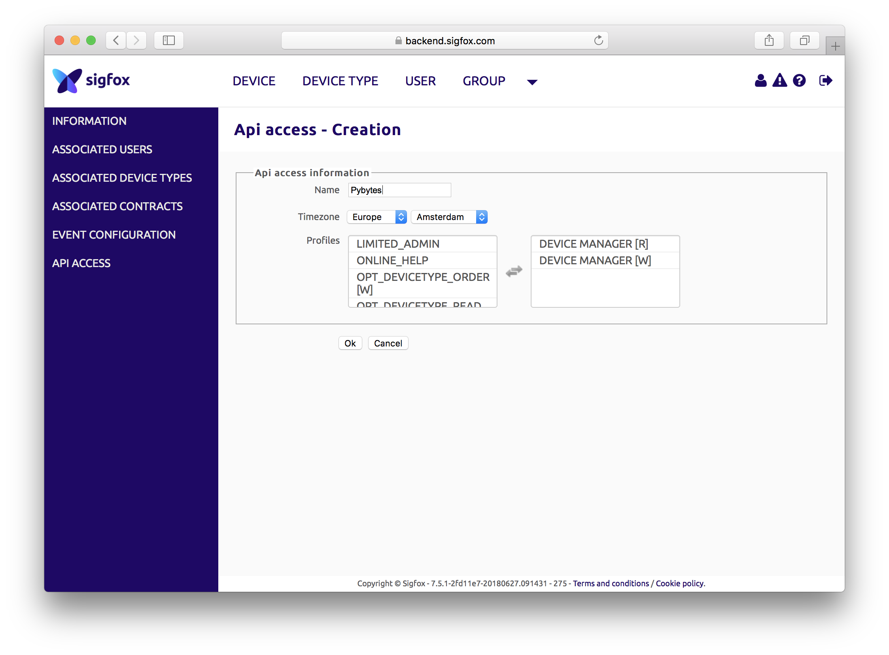

# Add Sigfox device


Before you start you need to create Sigfox account.
You need Pycom device with Sigfox to get your Sigfox account. **[Follow these instructions](../../../gettingstarted/registration/sigfox.md)**.


## Create Sigfox API credentials

Once you have you account setup and are logged in Sigfox backend, you need to create API credentials for Pybytes.

Click on GROUP &rarr; &lt;your_company_name&gt; &rarr; API ACCESS &rarr; New

In the form chose arbitrary *name*, select Profiles `DEVICE MANAGER [R]` and `DEVICE MANAGER [W]`.
Then click on Ok.

Copy *Login* and *Password* to the clipboard.

In Pybytes go to Settings &rarr; Sigfox API or [follow this link](https://pybytes.pycom.io/settings/sigfox-credentials) then paste in the form.

## Sigfox contract types

### Sigfox DevKit contracts

Read more how to use Sigfox with [devKit contract](./sigfoxDevKit.md).

### Sigfox custom contracts

Read more how to use Sigfox with [Custom contract](./sigfoxDevKit.md).
