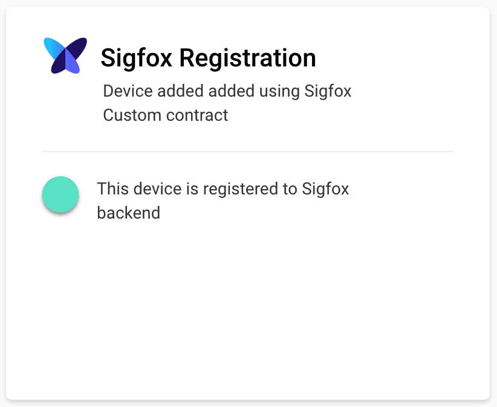

# Sigfox Custom contract

For building Sigfox application on Pybytes we recommend to [buy Sigfox contract](https://buy.sigfox.com/).

With Sigfox custom contract you can use Pybytes to register Sigfox devices on Sigfox backend automatically
(Pybytes talk to Sigfox backend API to register Sigfox devices automatically).

You can select Sigfox *device type* associated with your Sigfox *custom contract*.

Newly created devices will be added to selected device type completely by Pybytes.

## Adding devices using Sigfox custom contract

Go to: Settings (in sidebar) &rarr; Sigfox API &rarr; Settings

and select Sigfox device type which is associated with Sigfox custom contract.

### Add your Sigfox device to Pybytes
1. Create Sigfox device (Lopy4, SiPy, FiPy) in Pybytes and copy its device token to clipboard.
2. Connect your device to your computer and update it with Pycom firmware updater.
    1. Select Pybytes firmware
    2. Paste your device token to firmware updater


Detailed steps which are same for all devices are **[described here](../quick.md)**.


After your device was flashed with Pybytes firmware in automatically start adding itself to Sigfox backend.

## Troubleshooting

[Disengage Sigfox sequence number](../../../tutorials/sigfox/disengage_seq_num.md)
