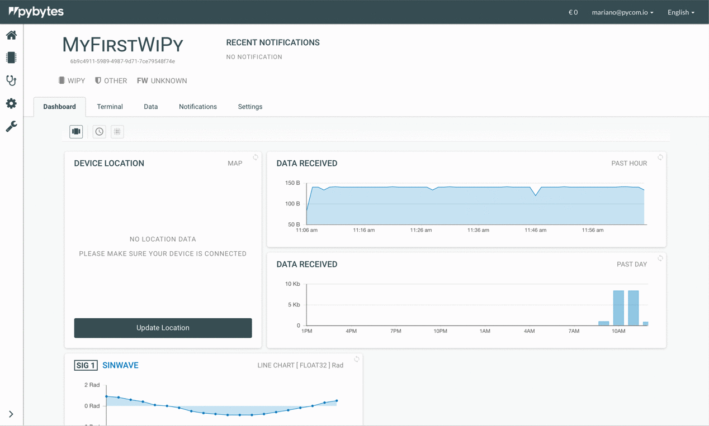
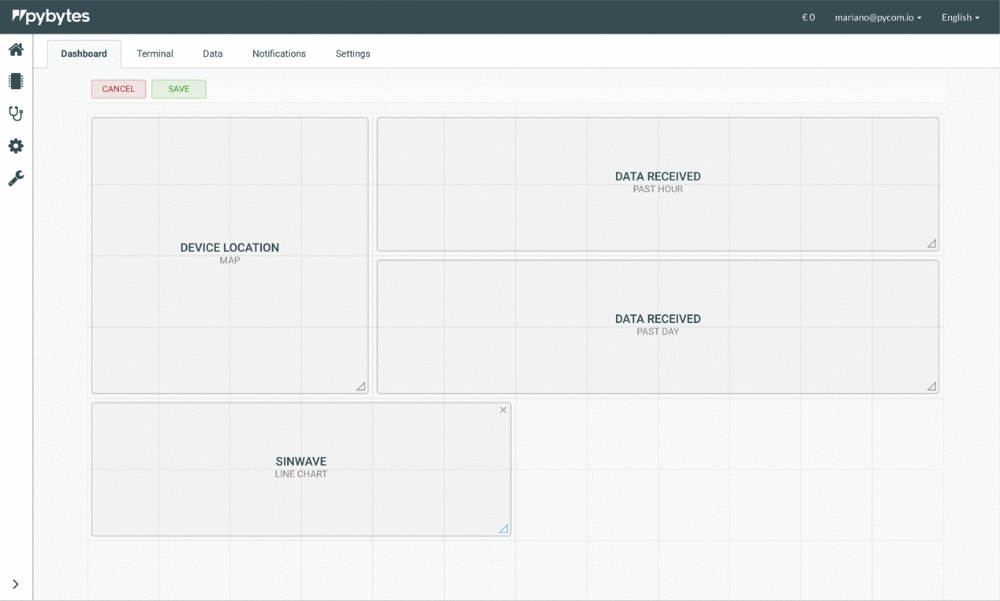

# Visualise data from your device.

In this section, we will explain to you how to create widgets for data visualisation and set up your device's dashboard on Pybytes.

# Example


Before starting the next steps, we assume that you already have your device connected to Pybytes. Otherwise, you should do it before moving on. Check how to [add your device here](../connect/intro.md). After your done with that, you can continue here.


## Step 1: Set up your application (main.py)
The first step is to have an application running on your device.
The application in this example sends data from a vector every 10 seconds to Pybytes.

1. Open the ``main.py`` file on Pymakr;

2. Insert the following code on your ``main.py``;

```python
# # Import what is necessary to create a thread
import _thread
from time import sleep

# # Increment index used to scan each point from vector sensors_data
def inc(index, vector):
    if index < len(vector)-1:
        return index+1
    else:
        return 0

# # Define your thread's behaviour, here it's a loop sending sensors data every 10 seconds
def send_env_data():
    idx = 0
    sensors_data = [0, -0.2, -0.5, -0.7, -0.8, -0.9, -0.9, -0.9, -0.8, -0.6, -0.4, -0.2, 0, 0.3, 0.5, 0.7, 0.8, 0.9, 0.9, 0.9, 0.8, 0.6, 0.4, 0.1]

    while (pybytes):
        pybytes.send_virtual_pin_value(False, 1, sensors_data[idx])
        idx = inc(idx, sensors_data)
        sleep(10)

# # Start your thread
_thread.start_new_thread(send_env_data, ())
```


In this code, we're calling the function ``pybytes.send_virtual_pin_value(persistent, pin, value))`` to communicate with Pybytes. This function is part of the Pybytes library, and it has three arguments: ``persistent``, ``pin`` and ``value``.
- ``persistent`` denotes information that is infrequently accessed and not likely to be modified;
- ``pin`` represents which virtual pin is receiving data;
- ``value`` is the value being attributed to that particular pin.


3. Upload the code into your device. Now your device is sending data to Pybytes.

## Step 2: Add a signal from your device

Go to Pybytes.

1. On ``Devices`` page select a device;
<p></p>

2. On your device's page click on ``Data`` tab.
<p></p>

3. Click on the ``Define New Signal`` button.
<p></p>

4. Define the new signal by entering a number, a name, a data type and a unit. Finally, click on the button ``Define``.


The name and unit are labels used to identify your signal inside Pybytes (In this example we defined ``Sinwave`` as the name of the signal and ``Rad`` as the unit).

The signal number has to match the pin number that you defined on ``pybytes.send_virtual_pin_value`` function call, inside your ``main.py`` code (In this example we defined ``pin = 1``);

The datatype also has to match the variable used as argument on ``pybytes.send_virtual_pin_value`` function call, inside your ``main.py`` code (In this example our variable is a floating number; therefore we defined as a  ``Float32``).


<p></p>

5. Your signal was added!
<p></p>


## Step 3: Add a widget for the signal

1. Click on the signal card.
<p></p>

2. Click on the button  ``Create a new display``.
<p></p>

3. Select the type of visualisation (e.g. Bar chart or Line chart).
<p></p>

4. You can adjust the parameters of your widget at ``Settings``. After, click on the button ``Create``.
<p></p>

5. Your widget was created. Now, add your widget to your device's dashboard. Click on the button ``Edit`` on your widget.
<p></p>

6. Mark the checkbox ``Display on Dashboard`` at ``Settings``. Finally, click on the button ``Save``.
<p></p>

7. Click on the tab ``Dashboard``. Your widget was successfully added there!
<p></p>


## Step 4: Organise your dashboard

1. Click on the button ``Organise``. Now the dashboard's grid will allow you to resize and reposition its widgets.
<p></p>

2. Resize a widget by clicking on the triangle icon at the bottom right corner of the widget and drag the cursor over the grid. After, click on the button ``Save`` to save this action.
<p></p>

3. Reposition the widget by dragging and dropping over the grid. After, click on the button ``Save`` to save this action.
<p></p>

## Done!
Now you've learned how to set up your device's dashboard to display data. Also, you can add more widgets to other pins of your device.
