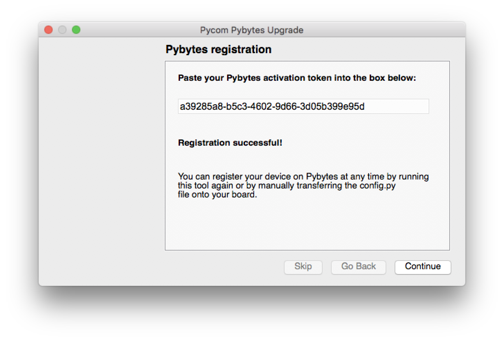
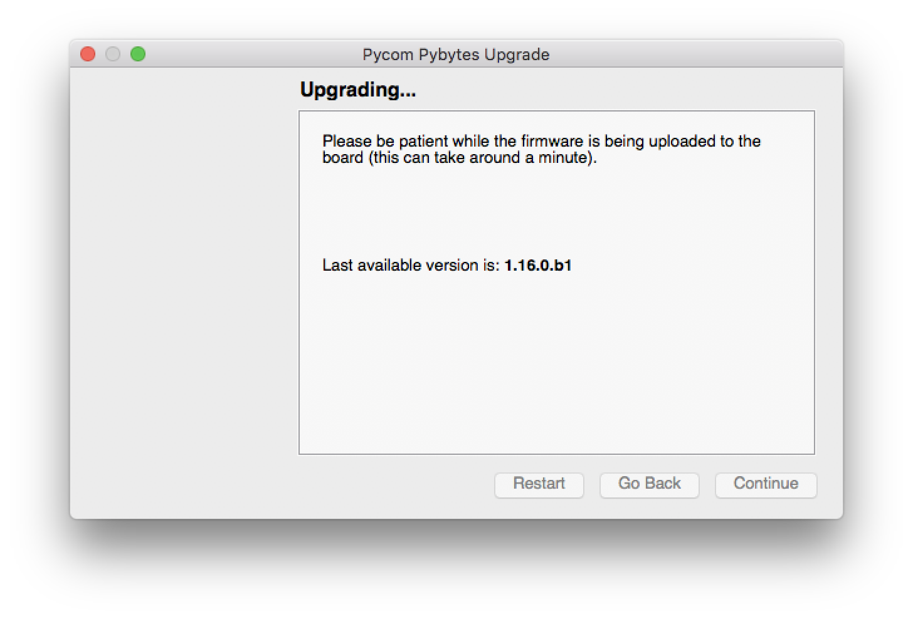

# Adding device quickly

From firmware 1.16.x onward all Pycom devices come with build in *Pybytes library* in firmware
specifically in `/frozen` folder. This allows you to add your device quickly to Pybytes.
You can still upload your Pybytes library [manually](quick-add-device.md).


If you [manually](quick-add-device.md) uploaded Pybytes library on your device before.
Make sure to do [factory reset](../toolsandfeatures/bootmodes.md#factory-reset-the-filesystems) of your device filesystem.
Otherwise code in `/flash` folder will have priority over build in 
library in `/frozen` folder.


## Follow these steps 
Install custom Firmware updater from Pybytes beta.

Put your device in firmware update mode:

Select your device serial port:

Copy and paste your device token from Pybytes here:

Now firmware updater is updating your firmware. It is asking Pybytes for your device credentials 
like WiFi password. It will write these information to device's config block.

Now your device will reboot and will be connected to Pybytes.

