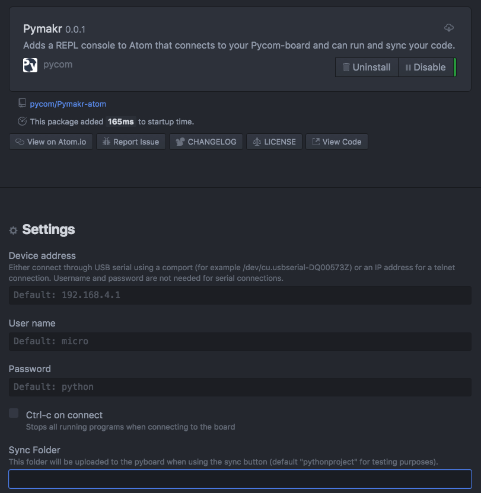

# Pymakr Plugin Installation for Atom

For beginners, users getting started with MicroPython & Pycom as well as Atom text editor users, we recommend the **Pymakr Plugin for Atom**. This section will help you get started using the Atom Text Editor & Pymakr Plugin.

Please follow these steps to install the Pymakr Plugin:

1. Ensure that you have Atom installed and open.
2. Navigate to the Install page, via Atom > Preferences > Install
3. Search for Pymakr and select the official Pycom Pymakr Plugin.
4. You should now see and Install button. Click this to download and install the Pymakr Plugin.
5. That’s it! You’ve installed the Pymakr Plugin for Atom.

## Initial Configuration

After installing the Pymakr Plugin, you need to take a few seconds to configure it for first time use. Please follow these steps:

1. Connect your Pycom device to your computer via USB. **Remove the wire between GND and G23**, before plugging in your device, if you have just finished upgrading your firmware!
2. Open Atom and ensure that the Pymakr Plugin has correctly installed.
3. In the menu, go to Atom > Preferences > Packages > Pymakr. This may vary depending on your operating system!
4. Open the Pymakr console by clicking the 'Open' button, located in the lower right side of the Atom window.
5. Click, 'More' followed by 'Get Serial Ports'. This will copy the serial address of your expansion board to your clipboard.
6. Navigate to 'Settings' > 'Global Settings'.
7. Paste this into the text field 'Device Address'.
8. Press connect and the Pymakr console should show three arrows '>>>', indicating that you are connected!


You can also connect to your device via WiFi as the device can open a telnet server. For more information please see the section below.


## Connecting via Serial USB

In order to use the Pymakr Plugin with a Pycom device via USB Serial, a couple of settings need to be configured. Below are the steps required to find, set and connect to a Pycom device over USB Serial.

1. Ensure that the Pycom device is turned on and connected (Normal or Safe Boot Mode)
2. Open Atom and verify that the Pymakr Plugins has been installed.
3. Click ``Open`` on the Pymakr Console, followed by the ``More`` tab.
4. Next click ``get serial ports``. This will copy the first serial port to the editor's clipboard.
5. Navigate to ``Global Settings`` and paste this address into the ``Device Address`` text field
6. Click ``Connect``


This process is easiest with either a Pycom Expansion Board or a Pytrack/Pysense as the addresses are automatically selected. For external products such as FTDI USB Serial Cables, the serial address may need to be copied manually. Additionally, the reset button on the device may also need to be pressed before a connection message appears.



If there are issues connecting over USB with the Pymakr Plugins, ensure that the correct FTDI drivers are installed. This issue is related to missing Windows drivers.


## Connecting via Telnet

After installing the Pymakr Plugin, a device may be connected via the telnet interface. Please see the following steps:

1. Ensure that Pycom device is turned on
2. Connect the host computer to the WiFi Access Point named after your board (the SSID will be as follows e.g. lopy-wlan-xxxx, wipy-wlan-xxxx). The ``password`` is www.pycom.io
3. Open Atom and verify that the Pymakr Plugins has been installed.
4. In the menu, go to Atom > Preferences > Packages > Pymakr (This will vary from MacOS/Linux/Windows).
5. By default, the address will be listed as 192.168.4.1. If not, change this to 192.168.4.1.
6. The default ``username`` and ``password`` are micro and python, respectively.
7. Click ``Connect``.

In the lower portion of the screen, within the console, press ``Connect`` and the connection process will take place. Upon completion, a message stating ‘Connecting on 192.168.4.1...’ will appear, followed a ``>>>`` prompt if successful.
