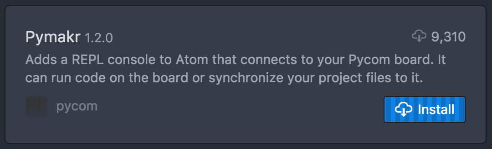
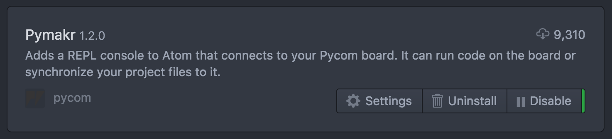
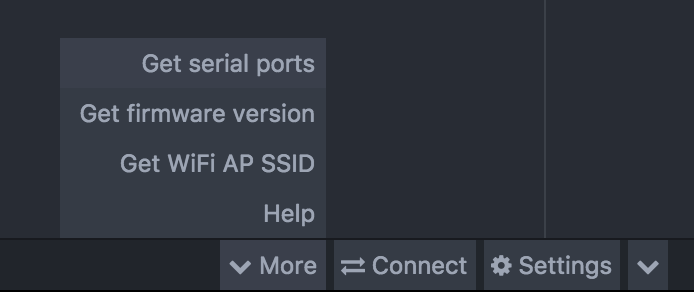
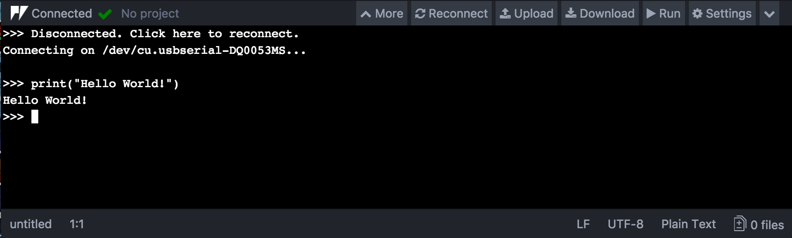

# Pymakr Plugin Installation for Atom

For beginners, users getting started with MicroPython & Pycom as well as Atom text editor users, we recommend the **Pymakr Plugin for Atom**. This section will help you get started using the Atom Text Editor & Pymakr Plugin.

Please follow these steps to install the Pymakr Plugin:

1. Ensure that you have Atom installed and open.

2. Navigate to the Install page, via `Atom > Preferences > Install`

3. Search for `Pymakr` and select the official Pycom Pymakr Plugin.

4. You should now see and click the Install button. This will download and install the Pymakr Plugin.

5. That’s it! You’ve installed the Pymakr Plugin for Atom.

## Connecting via Serial USB

After installing the Pymakr Plugin, you need to take a few seconds to configure
it for first time use. Please follow these steps:

1. Connect your Pycom device to your computer via USB. If you are using an
expansion board, and have just finished a firmware upgrade, be sure to **Remove
 the wire between GND and G23** and reset your device by pressing the button.
2. Open Atom and ensure that the Pymakr Plugin has correctly installed.

3. Open the Pymakr console by clicking the `^` button, located in the lower right side of the Atom window.

4. Click, `More` followed by `Get Serial Ports`. This will copy the serial address of your expansion board to your clipboard.

5. Navigate to `Settings > Global Settings`

6. Paste the serial address you copied earlier into the text field `Device Address`

7. Press connect and the Pymakr console should show three arrows ``>>>``, indicating that you are connected

These settings can also be applied on a per project basis by clicking `Settings`
then `Project Settings`. This will open a JSON file which you can edit to enter
your desired settings.


This process is easiest with either a Pycom Expansion Board or a Pytrack/Pysense
as the addresses are automatically selected. For external products such as FTDI
USB Serial Cables, the serial address may need to be copied manually.
Additionally, the reset button on the device may also need to be pressed before
a connection message appears.


## Connecting via Telnet

After installing the Pymakr Plugin, a device may be connected via the telnet
interface. Please see the following steps:

1. Ensure that Pycom device is turned on
2. Connect the host computer to the WiFi Access Point named after your board
(the SSID will be as follows e.g. `lopy-wlan-xxxx`, `wipy-wlan-xxxx`, etc.).
The password is `www.pycom.io`.
3. Follow the steps as above in the "Connecting via Serial USB" section but
enter `192.168.4.1` as the address.
4. The default username and password are `micro` and `python`, respectively.
5. Click `Connect` in the Pymakr pane, Pymakr will now connect via telnet.

