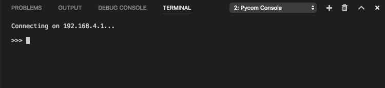

# Pymakr Plugin Installation for Visual Studio Code

Pycom also supports Microsoft's Visual Studio Code IDE platform with the Pymakr Plugin. To download Visual Studio Code, navigate to [VS Code](https://code.visualstudio.com/).

You will also need NodeJS installed on your PC. Please download the latest LTS version available [from the NodeJS website.](https://nodejs.org/)

Please follow these steps to install the Pymakr VSCode Extension:

1. Ensure that you have VSCode installed and open.
2. Navigate to the Extensions page, using the 5th button in the left navigation
3. Search for Pymakr and click the install button next to it.
4. Within a few minutes, a Reload button should appear. Press it to reload VSCode.
5. That’s it! You’ve installed the Pymakr Extension for VSCode

## Connecting via Serial USB

1. Ensure that the Pycom device is turned on and connected (Normal or Safe Boot Mode)
2. Open Visual Studio Code and verify that the Pymakr extension has been installed
3. Open the terminal if it wasn't open yet, using `View` -> `Intergrated Terminal` (or the `^+\`` shortcut)
4. Now click the `All commands` button on the bottom and click `Pymakr > List serial ports`. This will copy the first serial port to the editor's clipboard
5. Open the Global Settings file by clicking the `All commands` button and then `Pycom > Global Settings` and paste this address into the 'address' field
6. Click `All commands` then `Pymakr > Connect` to connect to your device


This process is easiest with either a Pycom Expansion Board or a Pytrack/Pysense as the addresses are automatically selected. For external products such as FTDI USB Serial Cables, the serial address may need to be copied manually. Additionally, the reset button on the device may also need to be pressed before a connection message appears.



If there are issues connecting over USB with the Pymakr Plugins, ensure that the correct FTDI drivers are installed. This issue is related to missing Windows drivers.


## Connecting via Telnet

After installing the Pymakr Plugin, a device may be connected via the telnet interface. Please see the following steps:

1. Ensure that Pycom device is turned on and connected (Normal or Safe Boot Mode)
2. Open Visual Studio Code and verify that the Pymakr extension has been installed
3. Open the terminal if it wasn't open yet, using `View` -> `Intergrated Terminal` (or the `^+\`` shortcut)
4. Connect the host computer to the WiFi Access Point named after your board (the SSID will be as follows e.g. `lopy-wlan-xxxx`, `wipy-wlan-xxxx`). The ``password`` is `www.pycom.io`. You may also connect your Pycom device to your router with a fixed IP (remember to record the IP address!).
5. Open the Global Settings file by clicking the `All commands` button and then `Pycom > Global Settings`
6. By default, the address will be listed as `192.168.4.1`. If not, change this to `192.168.4.1`. If you've connected your device to your home network, this will likely be different.
7. The default ``username ``and ``password`` are `micro` and `python`, respectively.
8. Click `All commands` then `Pymakr > Connect` to connect to your device

Use either the ``Connect`` command or click the ``Pycom console`` button on the left bottom and the connection process will take place. Upon completion, a message stating ‘Connecting on 192.168.4.1...’ will appear, followed a ``>>>`` prompt if successful.
