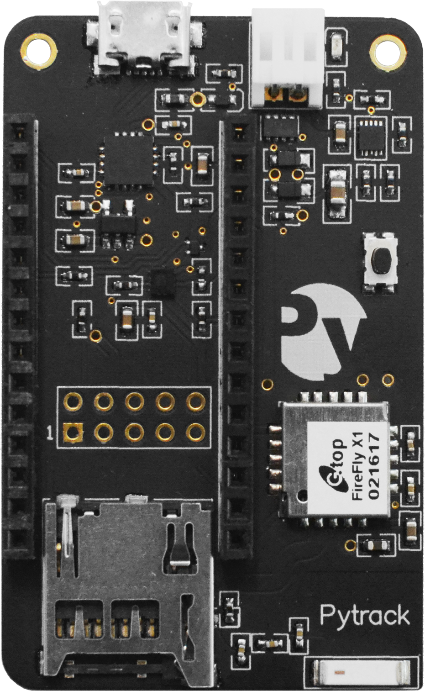

# Pytrack & Pysense

In addition to the Expansion Board, Pycom also offers two additional sensor boards, which are ideal for quickly building a fully functioning IoT solution! Whether the application is environment sensing or asset tracking, these additional boards support a variety of sensors.

### Pytrack

Pytrack is a location enabled version of the Expansion Board, intended for use in GPS applications such as asset tracking or monitoring.

#### Features & Hardware

The Pytrack is has a number of features including GPS, 3-Axis Accelerometer and Battery Charger. See the list below for detailed specifics about each sensor, including datasheets.

- Serial USB
- 3-Axis Accelerometer ([LIS2HH12](/chapter/pytrackpysense/apireference/pytrack.html))
- Battery Charger (BQ24040 with JST connector)
- GPS and GLONASS ([L76-L](/chapter/pytrackpysense/apireference/pytrack.html))
- MicroSD Card Reader

All of the included sensors are connected to the Pycom device via the I2C interface. These pins are located at P22 (SDA) and P21 (SCL).

### Pysense

Pysense is a sensor packed version of the Expansion Board, intended for use in environment sensing applications such as temperature, humidity monitoring, and light sensing.

#### Features & Hardware

The Pysense is packed with a number of sensors and hardware, see the list below for detailed specifics about each sensor, including datasheets.

- Serial USB
- 3-Axis Accelerometer ([LIS2HH12](/chapter/pytrackpysense/apireference/pysense.html))
- Battery Charger (BQ24040 with JST connector)
- Digital Ambient Light Sensor ([LTR-329ALS-01](/chapter/pytrackpysense/apireference/pysense.html))
- Humidity and Temperature Sensor ([SI7006-A20](/chapter/pytrackpysense/apireference/pysense.html))
- Barometric Pressure Sensor with Altimeter ([MPL3115A2](/chapter/pytrackpysense/apireference/pysense.html))
- MicroSD Card Reader

All of the included sensors are connected to the Pycom device via the I2C interface. These pins are located at `GPI09` (SDA) and `GPI08` (SCL).
