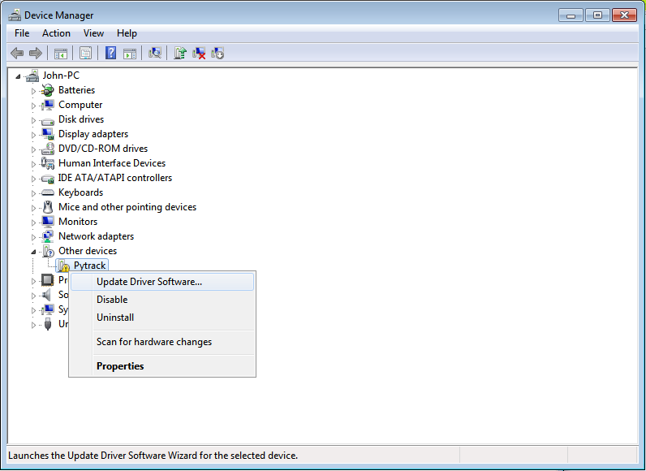
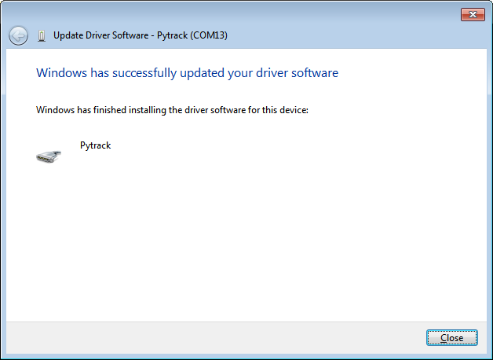
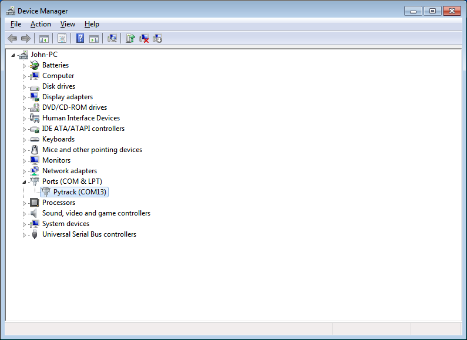

# Windows 7 Drivers

Pytrack and Pysense will work out of the box for Windows 8/10/+, Mac OS as well as Linux. If using Windows 7, drivers to support the boards will need to be installed.

Please follow the instructions below to install the required drivers.

### Download

Please download the driver software from the link below.

<a href="pycom.inf" download target="_blank">Pytrack/Pysense Driver</a>

### Installation

First navigate open the Windows start menu and search/navigate to ``Device Manager``. You should see your Pytrack/Pysense in the dropdown under **other devices**.

Right click the device and select ``Update Driver Software``.

Select the option to **Browse my computer for driver software**.

Next you will need to navigate to where you downloaded the driver to (e.g. **Downloads** Folder).

Specify the folder in which the drivers are contained. If you haven't extracted the ``.zip`` file, please do this before selecting the folder.

You may receive a warning, suggesting that windows can't verify the publisher of this driver. Click ``Install this driver software anyway`` as this link points to our official driver.

If the installation was successful, you should now see a window specifying that the driver was correctly installed.

To confirm that the installation was correct, navigate back to the ``Device Manager`` and click the dropdown for other devices. The warning label should now be gone and Pytrack/Pysense should be installed.

