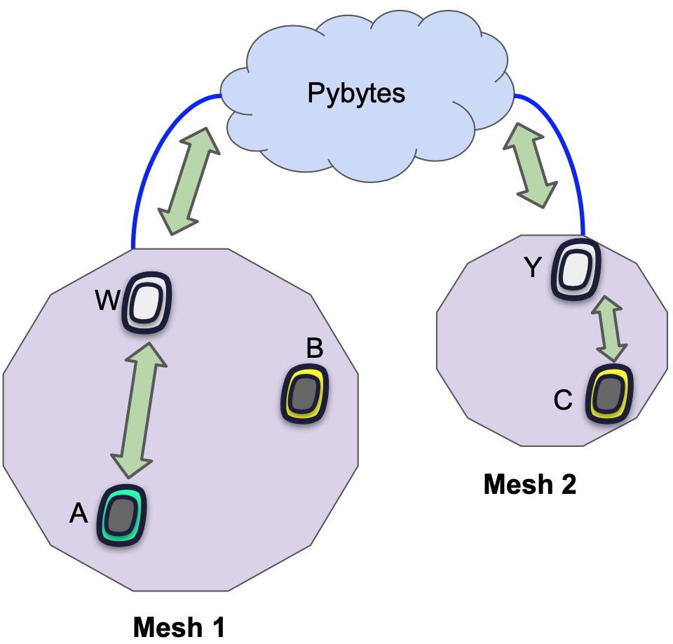

Pymesh supports several levels of encryption.

## Mesh Masterkey

Each node (Lopy/Fipy) initializes Pymesh with a 128 bits Masterkey. This is used in:

* authentication
 * a Node which does not have the Masterkey of the peer, can't connect to peer's Pymesh;
 * further, it will create its own Pymesh, using its Masterkey, so it will become the Leader of a new Mesh network.
* encryption
 * all traffic inside Pymesh is encrypted with Masterkey
  * encryption is AES-128bits.

## End to end encryption
End to end encryption is used when Node A wants to communicate securely/secretly with Node B. The data packets will be routed by other nodes, but the actual message can't be decrypted by any middle Node.

This encryption can be used even for communicating between Nodes that are not in the same mesh, as message is encrypted until destination. For example, in the next picture, Node A can communicate encrypted with Node C.

The challenge is in distributing the keys used for encryption(decryption), this is

### Symmetric encryption

Symmetric-key algorithms are algorithms for cryptography that use the same cryptographic keys for both encryption of plaintext and decryption of ciphertext. More info could be checked on [Symmetric-key algorithm](https://en.wikipedia.org/wiki/Symmetric-key_algorithm).

A micropython example script can be seen [here](../../firmwareapi/pycom/aes.md) using AES 128, 192 or 256 bits keys (`crypto.AES` class).

### Asymmetric encryption

Public-key cryptography, or asymmetric cryptography, is a cryptographic system that uses pairs of keys: public keys which may be disseminated widely, and private keys which are known only to the owner. More info could be checked on [Public-key cryptography](https://en.wikipedia.org/wiki/Public-key_cryptography).

A micropython example script can be seen [here](../../firmwareapi/micropython/ucrypto.md) using RSA 2048 bits keys (`crypto.rsa_encrypt()` method).
