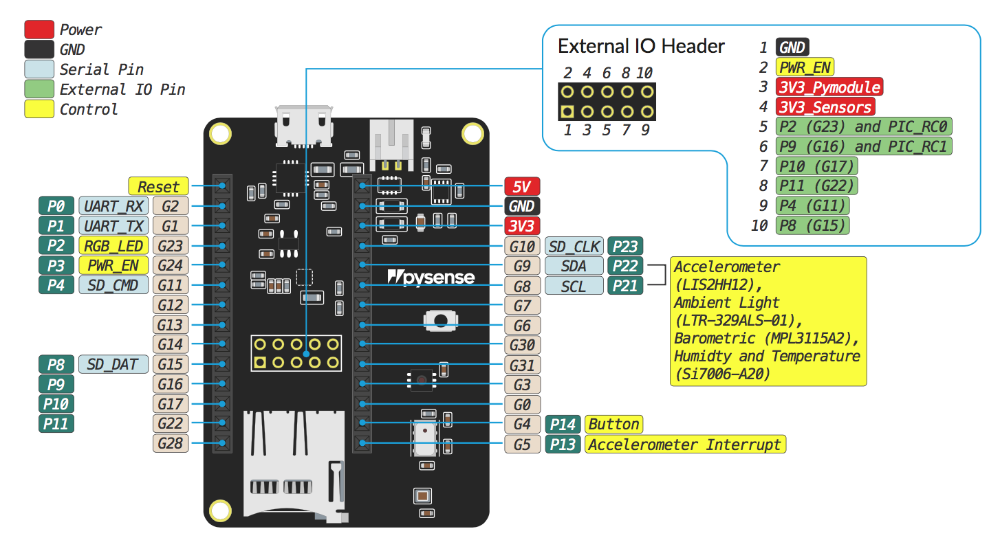

# Pysense

 

## Datasheet

The datasheet of the Pysense is available as a PDF File.



## Pinout

The pinout of the Pysense is available as a PDF File



## Battery Charger

The board features a single cell Li-Ion/Li-Po charger. When the board is being powered via the micro USB connector, it will charge the battery \(if connected\).

