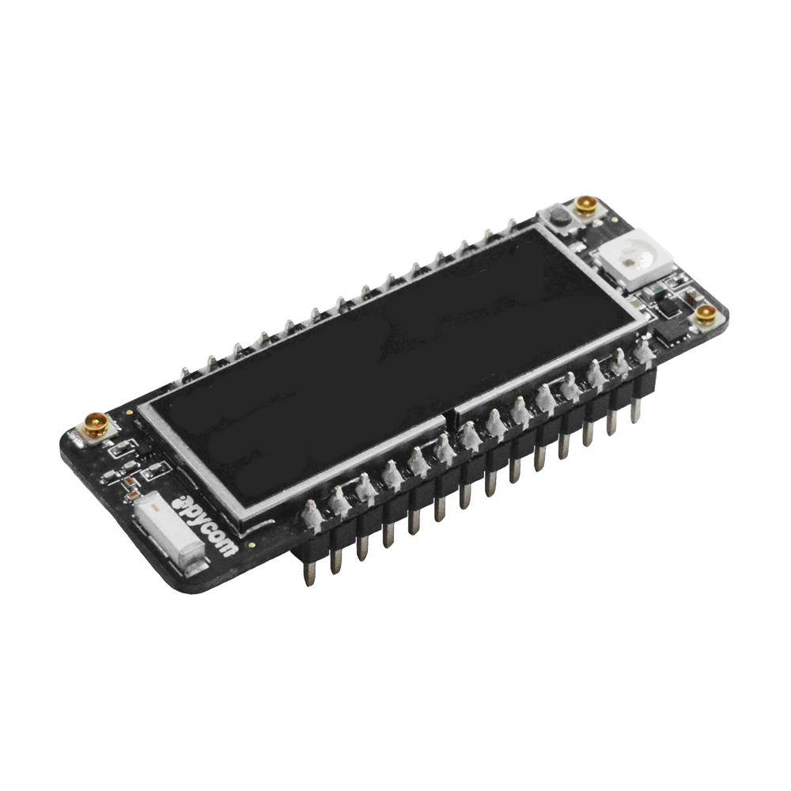
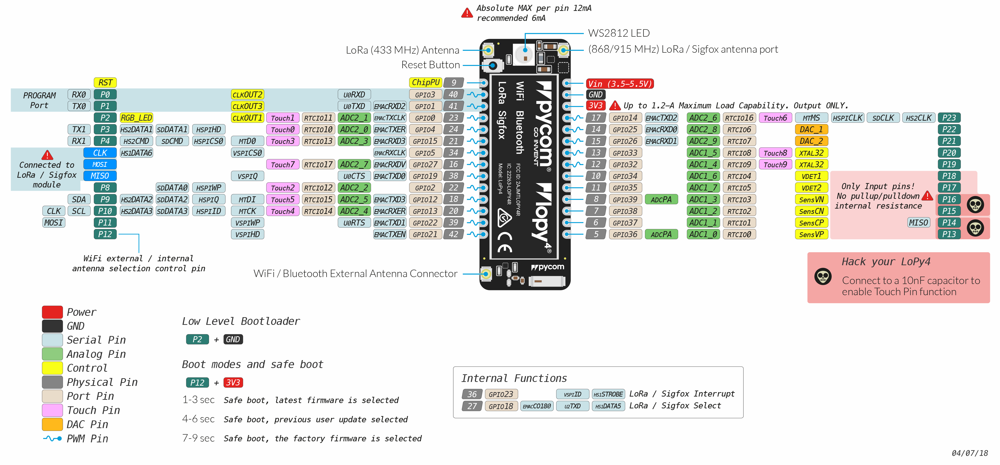

# LoPy 4

\*\*\*\* ****

**Store**: [Buy Here](https://pycom.io/product/lopy4/)

**Getting Started:** [Click Here](../../gettingstarted/connection/lopy4.md)

## Datasheet

The datasheet of the LoPy4 is available as a PDF File.



## Pinout

The pinout of the LoPy4 is available as a PDF File




Please note that the PIN assignments for UART1 \(TX1/RX1\), SPI \(CLK, MOSI, MISO\) and I2C \(SDA, SCL\) are defaults and can be changed in Software.


## Notes

### WiFi

By default, upon boot the LoPy4 will create a WiFi access point with the SSID `lopy4-wlan-XXXX`, where `XXXX` is a random 4-digit number, and the password `www.pycom.io`.

The RF switch that selects between the on-board and external antenna is connected to `P12`, for this reason using `P12` should be avoided unless WiFi is disabled in your application.

### Power

The `Vin` pin on the LoPy4 can be supplied with a voltage ranging from `3.5v` to `5.5v`. The `3.3v` pin on the other hand is output **only**, and must not be used to feed power into the LoPy4, otherwise the on-board regulator will be damaged.

## Tutorials

Tutorials on how to the LoPy4 module can be found in the [examples](../../tutorials/introduction.md) section of this documentation. The following tutorials might be of specific interest for the LoPy4:

* [WiFi connection](../../tutorials/all/wlan.md)
* [LoRaWAN node](../../tutorials/lora/lorawan-abp.md)
* [LoRaWAN nano gateway](../../tutorials/lora/lorawan-nano-gateway.md)
* [Sigfox](../../tutorials/sigfox.md)
* [BLE](../../tutorials/all/ble.md)

