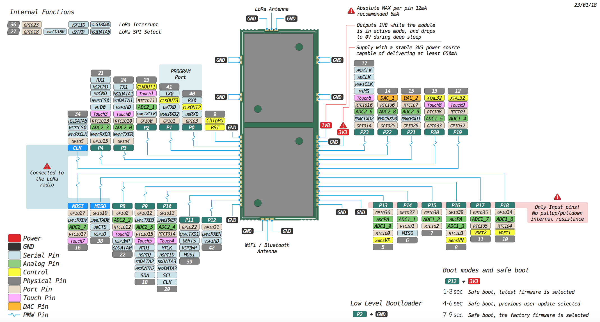

# L01

## Pinout

The pinout of the L01 is available as a PDF File



## Specsheets

The specsheet of the L01 is available as a PDF File.



## Drawings

The drawings for the L01 are available as a PDF File.




Please note that the PIN assignments for UART1 \(TX1/RX1\), SPI \(CLK, MOSI, MISO\) and I2C \(SDA, SCL\) are defaults and can be changed via software.


## Tutorials

Tutorials on the L01 module can be found in the [examples](../../tutorials/introduction.md) section of this documentation. The following tutorials might be of  interest for those using the L01:

* [WiFi connection](../../tutorials/all/wlan.md)
* [LoRaWAN node](../../tutorials/lora/lorawan-abp.md)
* [LoRaWAN nano gateway](../../tutorials/lora/lorawan-nano-gateway.md)
* [BLE](../../tutorials/all/ble.md)
