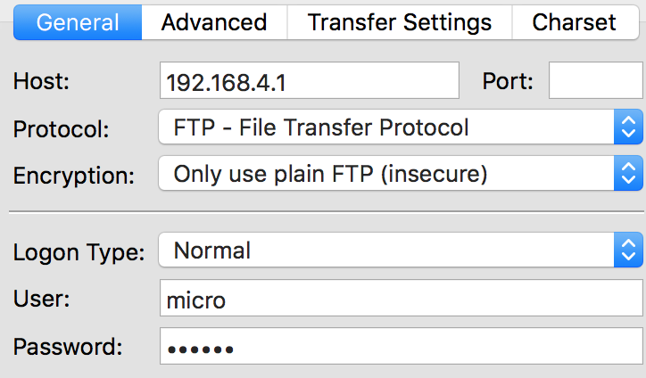

# FTP

There is a small internal file system accessible with each Pycom device, called `/flash`. This is stored within the external serial flash memory. If a microSD card is also connected and mounted, it will be available as well. When the device starts up, it will always boot from the `boot.py` located in the `/flash` file system.

The file system is accessible via the native FTP server running on each Pycom device. Open an FTP client and connect to:

* url: `ftp://192.168.4.1`
* username: `micro`
* password: `python`

See [network.server](../../firmwareapi/pycom/network/server.md) for information on how to change the defaults. The recommended clients are:

* macOS/Linux: default FTP client
* Windows: Filezilla and FireFTP

For example, from a macOS/Linux terminal:

```bash
$ ftp 192.168.4.1
```

The FTP server doesn’t support active mode, only passive mode. Therefore, if using the native unix FTP client, immediately after logging in, run the following command:

```bash
ftp> passive
```

The FTP server only supports one connection at a time. If using other FTP clients, please check their documentation for how to limit the maximum allowed connections to one at a time.

## FileZilla

If using FileZilla, it's important to configure the settings correctly.

Do not use the quick connect button. Instead, open the site manager and create a new configuration. Within the `General` tab, ensure that encryption is set to: `Only use plain FTP (insecure)`.



In the `Transfer Settings` tab, limit the max number of connections to one. Other FTP clients may behave in a similar ways; visit their documentation for more specific information.


