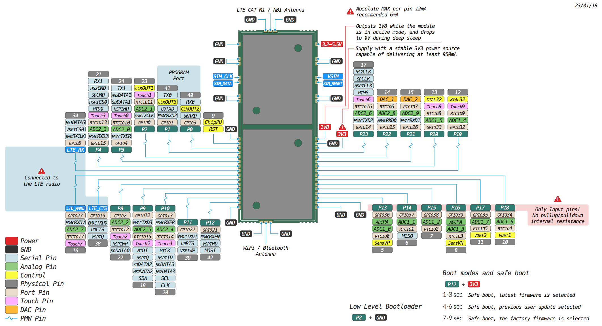

# 6.2.4 G01

## Pinout

The pinout of the G01 is available as a PDF File



## Specsheets

The specsheet of the G01 is available as a PDF File.



## Drawings

The drawings for the G01 is available as a PDF File.




Please note that the PIN assignments for UART1 \(TX1/RX1\), SPI \(CLK, MOSI, MISO\) and I2C \(SDA, SCL\) are defaults and can be changed in Software.


## AT Commands

The AT commands for the Sequans Monarch modem on the G01 are available in a PDF file.



## Tutorials

Tutorials on how to the G01 module can be found in the [examples](../../tutorials-and-examples/introduction.md) section of this documentation. The following tutorials might be of specific interest for the G01:

* [WiFi connection](../../tutorials-and-examples/all/wlan.md)
* [LTE CAT-M1](../../tutorials-and-examples/lte/cat-m1.md)
* [NB-IoT](../../tutorials-and-examples/lte/nb-iot.md)
* [BLE](../../tutorials-and-examples/all/ble.md)

