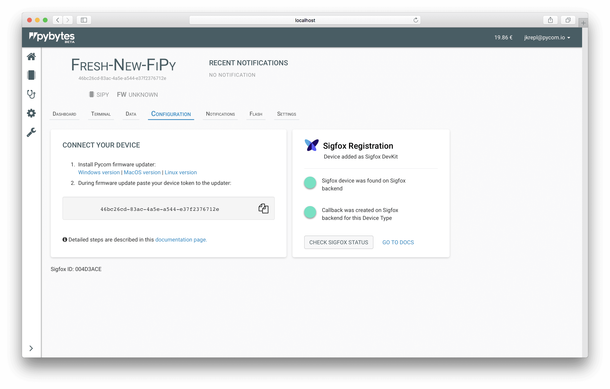

# DevKit contract

Every Sigfox Pycom device comes with free Sigfox connectivity - Sigfox DevKit contract. It provides one year of Sigfox connectivity. This is great for prototyping.

But every device you want to add to Pybytes you need register on Sigfox backend. You need to repeat [Sigfox activation procedure](../../../gettingstarted/registration/sigfox.md).

After you add your Sigfox credentials to Pybytes you can see DevKit contract type is selected as default \(on page Settings → Sigfox API\).

## Add your device to Pybytes

1. Create Sigfox device \(Lopy4, SiPy, FiPy\) in Pybytes and copy its device token to clipboard.
2. Connect your device to your computer and update it with Pycom firmware updater.
   1. Select Pybytes firmware
   2. Paste your device token to firmware updater


Detailed steps which are same for all devices are [**described here**](../quick.md).


## Check sigfox status

Go to: Devices → &lt;your\_device\_name&gt; → configuration

Now you should see sigfox status component.

Click on _Check Sigfox status_ button

You should see two green lights.

First green light means that your device was found in Sigfox group which uses Sigfox API credentials you saved to Pybytes.

Second green light means that HTTP POST callback was created on Sigfox backend for your _Dev Kit_ device type. Because Dev Kit device type is associated with Dev Kit contract \(which can hold only one device\), you need to create Sigfox callback for every device you add to Pybytes.

Note that Sigfox callback are associated to Sigfox device types.

This is not an issue with Custom contract, where _device type_ on Sigfox backend can contain many devices, therefore you just need to one Sigfox HTTP POST callback \(It is created automatically by Pybytes\).

## Troubleshooting

[Disengage Sigfox sequence number](../../../tutorials/sigfox.md#disengage-sequence-number)

