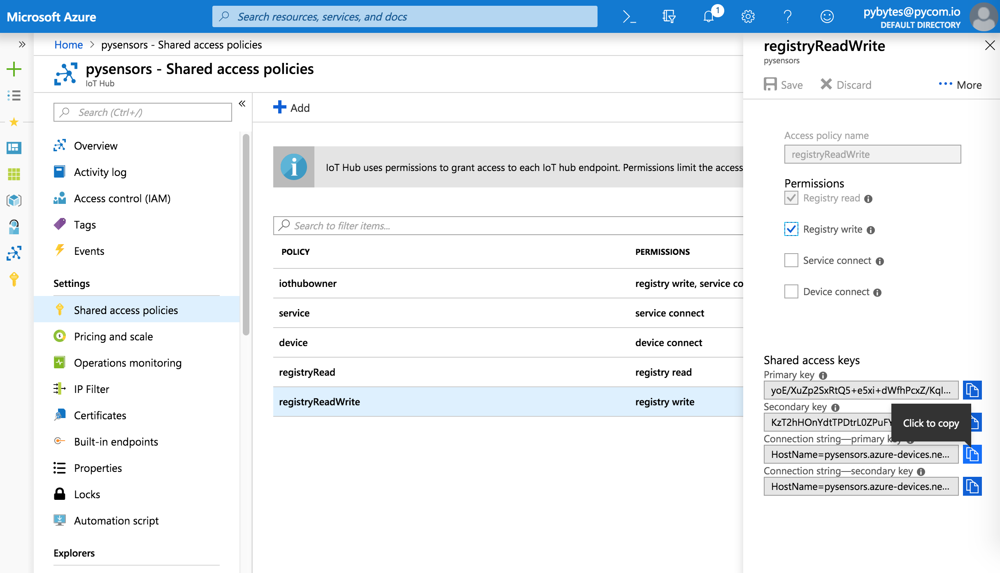
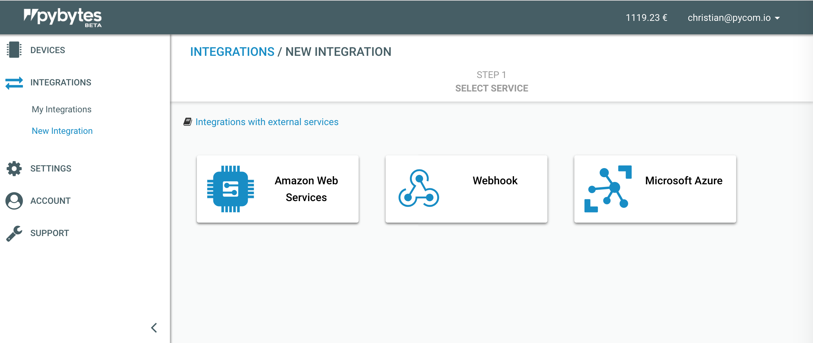
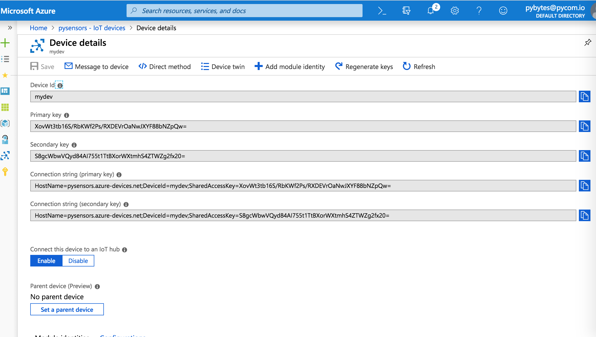

# Azure

Whenever one of your integrated devices sends a signal to our broker, we republish the binary payload to the endpoint specified for its integration through [Azure IoT Hub SDK](https://docs.microsoft.com/en-us/azure/iot-hub/iot-hub-devguide-sdks).

## Integrate your devices

1. The first step requires you to create an [IoT Hub](https://docs.microsoft.com/en-us/azure/iot-hub/). This is an Azure service that enables you to ingest high volumes of telemetry from your IoT devices into the cloud for storage or processing. In order to do that, [follow the offical documentation](https://docs.microsoft.com/en-us/azure/iot-hub/iot-hub-create-through-portal). To summarize you'll need to:
    - specify your [subscription plan](https://account.azure.com/subscriptions/)
    - create or choose a [resource group](https://docs.microsoft.com/en-us/azure/azure-resource-manager/resource-group-portal), a container that holds resources that share the same lifecycle, permissions, and policies. This name must contains only alphanumeric characters, periods, underscores, hyphens and parenthesis and cannot end in a period.
    - choose a [region](https://azure.microsoft.com/en-us/global-infrastructure/regions/)
    - choose the Iot Hub name (its length must be between 3 and 50, and it must contains only alphanumeric characters and hyphens). It won't be possible to change this name later.
    - [specify tier scaling and units](https://docs.microsoft.com/en-us/azure/iot-hub/iot-hub-scaling)

2. Now copy and paste a connection string with the privilege to write into the registry by clicking on the relative button

3. Now go into Pybytes and click on *Integrations* > *New Integration* and choose *Microsoft Azure*. Paste the IoT Hub Connection String copied from the previous step and click *Login*

4. This step requires you to create a custom MQTT topic and the devices you want to bind to this Azure IoT hub. All the messages sent by your devices, will be republished to the Azure's MQTT broker with the topic specified here.
When you're ready, click _Create_

5. If everything's worked as expected, you should be able to see a summary of your integration like the following:

6. The corresponding device has been created in Azure as well, you just have to [log in to the portal](https://portal.azure.com/), click on its IoT Hub and then click on the device just created. You should be able to see all the device's details, also the connection string which will be saved encrypted in our database and used to republish your data to your Azure IoT Hub.

7. Try to send some signal messages with your device. You should be able to see in the dashboard that the system has received them. More information on testing device's connectivity could be found [here](https://docs.microsoft.com/en-us/azure/iot-hub/tutorial-connectivity).

## Final considerations

In order to see the data sent to Azure, you could do different things, depending on the scope of your work. Please refer to these official examples:
- [Visualize real-time sensor data from Azure IoT Hub using Power BI](https://docs.microsoft.com/en-us/azure/iot-hub/iot-hub-live-data-visualization-in-power-bi)
- [Visualize real-time sensor data from your Azure IoT hub by using the Web Apps feature of Azure App Service](https://docs.microsoft.com/en-us/azure/iot-hub/iot-hub-live-data-visualization-in-web-apps)
- [Read the telemetry from the hub with a back-end application (Node.js)](https://docs.microsoft.com/en-us/azure/iot-hub/quickstart-send-telemetry-node)
- [Configure message routing with IoT Hub](https://docs.microsoft.com/en-us/azure/iot-hub/tutorial-routing)

**Warning**: do not delete Azure devices directly from Azure user interface, otherwise the integration with Pybytes will stop working. Always use Pybytes interface to delete Azure devices.