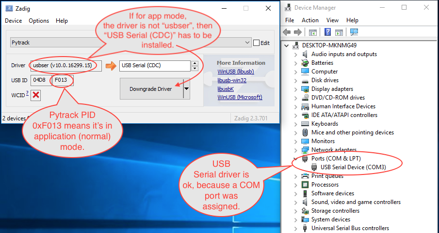

# Updating Firmware

To update the firmware on the Pysense/Pytrack/Pyscan/Expansion Board v3, please see the following instructions. The firmware of Pysense/Pytrack/Pyscan/Expansion Board v3 can be updated via the USB port using the terminal tool, `DFU-util`.

The latest firmware DFU file can be downloaded from the links below:

* [Pytrack DFU](https://software.pycom.io/findupgrade?key=pytrack.dfu&type=all&redirect=true)
* [Pysense DFU](https://software.pycom.io/findupgrade?key=pysense.dfu&type=all&redirect=true)
* [Expansion Board DFU](https://software.pycom.io/findupgrade?key=expansion3.dfu&type=all&redirect=true)

While in the normal, application mode, the Pysense/Pytrack/Pyscan/Expansion Board v3 require a Serial USB CDC driver, in DFU, bootloader mode, the DFU driver is required. Below, the USB Product ID is depicted for each case.

| Board | DFU bootloader \(update mode\) | Application firmware \(normal mode\) |
| :--- | :--- | :--- |
| Pytrack | `0xF014` | `0xF013` |
| Pysense | `0xF011` | `0xF012` |
| Pyscan | `0xEF37` | `0xEF38` |
| Expansion Board v3 | `0xEF99` | `0xEF98` |

_Note: USB Vendor ID is always_ `0x04D8`_._

## Installing the DFU-util Tools

### macOS

If using `homebrew`:

```bash
$ brew install dfu-util
```

If using `MacPorts`:

```bash
port install libusb dfu-util
```

### Linux

Ubuntu or Debian:

```bash
$ sudo apt-get install dfu-util
```

Fedora:

```bash
$ sudo yum install dfu-util
```

Arch:

```bash
$ sudo pacman -Sy dfu-util
```

### Windows

* [DFU-util v0.9](http://dfu-util.sourceforge.net/releases/dfu-util-0.9-win64.zip) – Tool to upload the firmware to the Pytrack/Pysense
* [Zadig](http://zadig.akeo.ie/) – Installer tool for the Pytrack/Pysense board DFU Firmware

To uploaded the latest DFU firmware to the Pytrack/Pysense, **first install the DFU drivers** to the host computer. Open Zadig and select `libusbK` as the driver.

To install the drivers, the Pytrack/Pysense board must be in DFU-mode:

1. Disconnect the USB cable
2. Hold down the button on the shield
3. Connect the USB cable
4. Keep the button pressed for at least one second
5. Release the button. When the board is connected in DFU-mode, it will be in this state for 7 seconds.
6. Click the`“Install Driver` button immediately. If the driver was unsuccessful, repeat from step 1.
   * _Here the USB ID has to be the DFU-bootloader one \(_`0xF014`_for Pytrack or_ `0xF011` _for Pysense\)._
   * _This is a successful DFU driver installation for Pytrack:_


Open the command prompt and navigate to the directory where the DFU-util and the firmware was downloaded \(must be in same directory\). Repeat the procedure to get the board in DFU-mode and run the command below but replace `X.X.X` with the firmware version and replace Pysense with Pytrack if it is the Pytrack that is to be updated \(e.g: `pytrack_0.0.8.dfu`\):

```bash
dfu-util-static.exe -D pysense_X.X.X.dfu
```

If the update was successful, a message,"Done!" should appear in the bottom of the command prompt.

**Double-check Serial USB \(CDC\) driver is installed in Application mode:** if, by mistake, the `libusbk` driver was installed while the USB ID is the Application mode \(`0xF013` for Pytrack or `0xF012` for Pysense\), then the `Serial USB (CDC)` driver has to be installed for application mode. This will allow Windows to allocate a COM port, which is required for REPL console.



## Using DFU-util with Pytrack, Pysense and Expansion Board v3

To enter update mode follow these steps:

1. Unplug the device
2. Press the button and keep it held \(on the Expansion Board the `S1` button\)
3. Plug in the USB cable to the host computer and wait 1 second before releasing the button
4. After this you will have approximately 7 seconds to run the DFU-util tool

### macOS and Linux:

```bash
$ dfu-util -D pytrack_0.0.8.dfu
```


You might need to run `dfu-util` as `sudo`. In that case, you will need to enter your password.


An output, similar to the one below, will appear upon successful installation:

```bash
dfu-util 0.9

Copyright 2005-2009 Weston Schmidt, Harald Welte and OpenMoko Inc.
Copyright 2010-2016 Tormod Volden and Stefan Schmidt
This program is Free Software and has ABSOLUTELY NO WARRANTY
Please report bugs to http://sourceforge.net/p/dfu-util/tickets/

Match vendor ID from file: 04d8
Match product ID from file: f014
Opening DFU capable USB device...
ID 04d8:f014
Run-time device DFU version 0100
Claiming USB DFU Runtime Interface...
Determining device status: state = dfuIDLE, status = 0
dfu-util: WARNING: Runtime device already in DFU state ?!?
Claiming USB DFU Interface...
Setting Alternate Setting #0 ...
Determining device status: state = dfuIDLE, status = 0
dfuIDLE, continuing
DFU mode device DFU version 0100
Device returned transfer size 64
Copying data from PC to DFU device
Download    [=========================] 100%        16384 bytes
Download done.
state(2) = dfuIDLE, status(0) = No error condition is present
Done!
```

#### Debugging

Using `lsusb` command, the Pytrack/Pysense device should be visible in both normal and bootloader modes.

For exemple, a Pytrack board is visible as either:

* `Bus 020 Device 004: ID 04d8:f014 Microchip Technology Inc. Application Specific Device`
  * this is bootloader mode \(`f014` is USB PID\), active just for 7-8 seconds, if the reset button was just  pressed before plugging USB connector.
* `Bus 020 Device 005: ID 04d8:f013 Microchip Technology Inc. Pytrack Serial: Pyabcde0`
  * this is normal, application mode \(`f013` is USB PID\), this means the bootloader verified application partition and it boot-up correctly.

